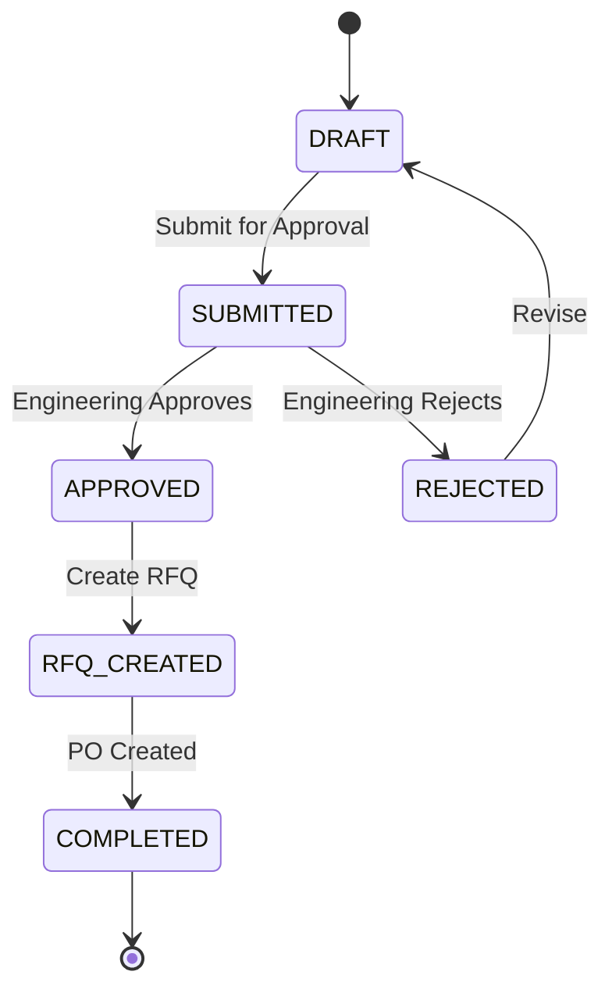
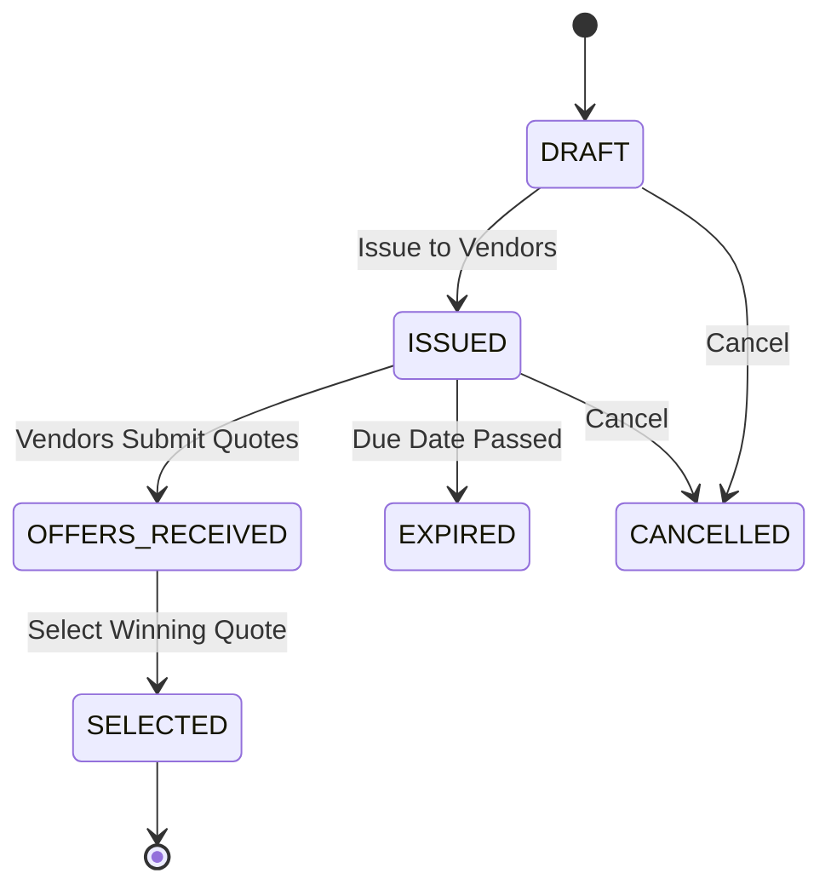
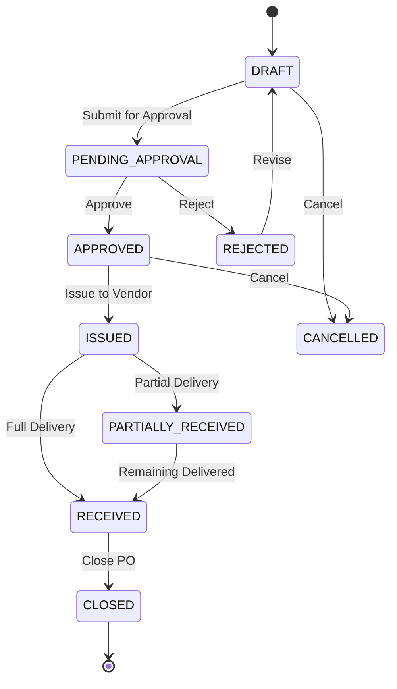
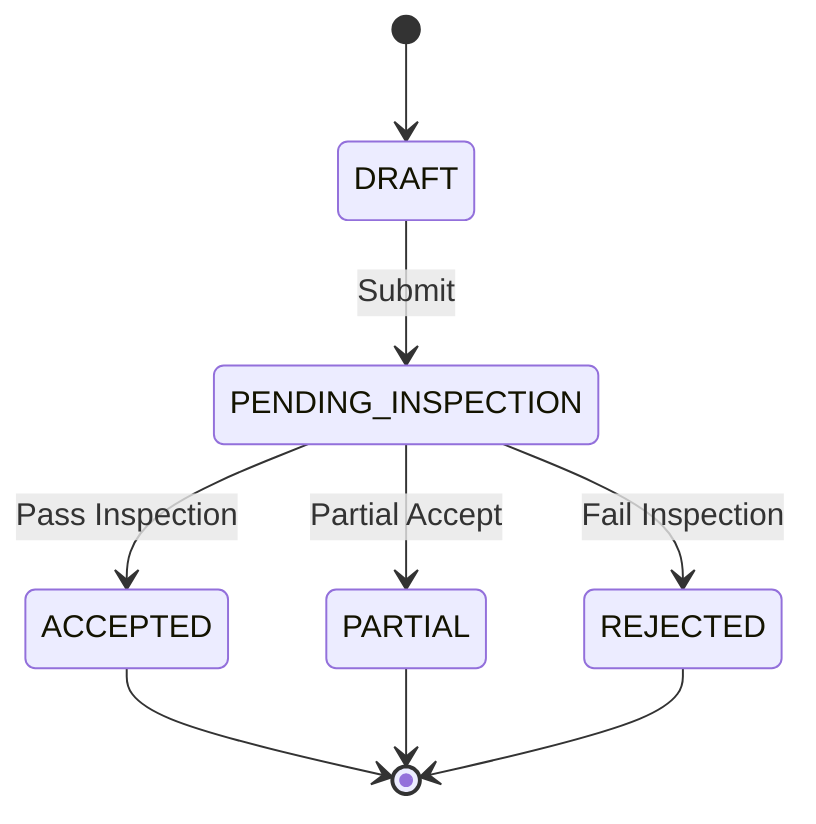
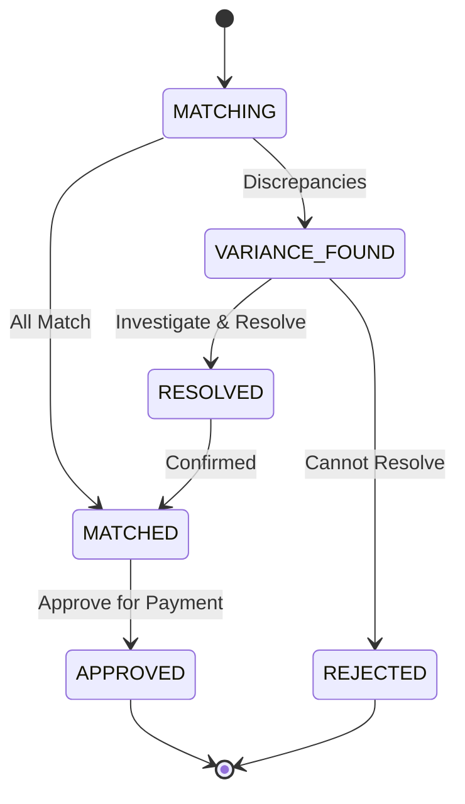
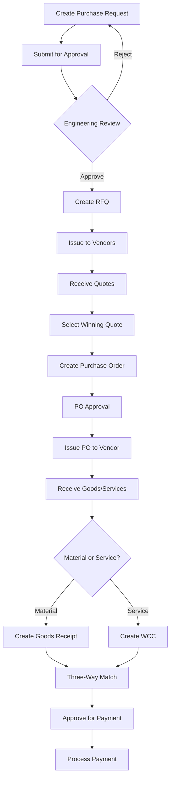

# Procurement Module User Manual

## Table of Contents

1. [Overview](#overview)
2. [Purchase Requests](#purchase-requests)
3. [Engineering Approval](#engineering-approval)
4. [Requests for Quotation (RFQ)](#requests-for-quotation-rfq)
5. [Purchase Orders](#purchase-orders)
6. [Packing Lists](#packing-lists)
7. [Goods Receipts](#goods-receipts)
8. [Work Completion Certificates](#work-completion-certificates)
9. [PO Amendments](#po-amendments)
10. [Three-Way Match](#three-way-match)
11. [Workflow Summary](#workflow-summary)

---

## Overview

The Procurement Module provides end-to-end procurement workflow management, from initial purchase requests through to goods receipt and payment processing. It supports both material and service procurement with full approval workflows.

### Key Features

- Purchase Request creation and approval workflow
- RFQ generation and vendor quotation management
- Purchase Order creation and tracking
- Goods receipt and quality verification
- Work completion certificates for services
- Three-way matching for payment control
- Full audit trail and status tracking

### Navigation

Access the Procurement Module from the main dashboard by clicking **Procurement** in the navigation menu.

[Screenshot: Main Dashboard with Procurement Module highlighted]

---

## Purchase Requests

Purchase Requests (PRs) are the starting point of the procurement process. They document the need for materials, services, or equipment.

### PR Status Workflow



### Status Definitions

| Status      | Color  | Description                             |
| ----------- | ------ | --------------------------------------- |
| DRAFT       | Gray   | PR is being prepared, not yet submitted |
| SUBMITTED   | Blue   | Awaiting engineering approval           |
| APPROVED    | Green  | Approved, ready for RFQ creation        |
| REJECTED    | Red    | Rejected by approver, needs revision    |
| RFQ_CREATED | Purple | RFQ has been generated from this PR     |
| COMPLETED   | Green  | Full procurement cycle complete         |

### Creating a Purchase Request

**Navigation:** Procurement → Purchase Requests → New Purchase Request

[Screenshot: New Purchase Request button on PR list page]

**Step 1: Basic Information**

1. Click the **New Purchase Request** button
2. Fill in the required fields:
   - **Title**: Brief description of what you're requesting
   - **Project**: Select the project this PR is for (required)
   - **Type**: Choose from:
     - Materials - Physical items/goods
     - Services - Work/labor
     - Equipment - Machinery/tools
   - **Category**: Select appropriate category
   - **Priority**: URGENT, HIGH, MEDIUM, or LOW

[Screenshot: PR Form - Basic Information section]

**Step 2: Line Items**

1. Click **Add Item** to add procurement items
2. For each item, specify:
   - **Description**: What you need
   - **Quantity**: How many units
   - **Unit**: Unit of measure (pcs, kg, m, etc.)
   - **Estimated Unit Price**: Expected cost per unit
   - **Required Date**: When you need it

[Screenshot: PR Form - Line Items section]

**Step 3: Additional Details**

1. Add any **Notes** or special instructions
2. Attach relevant documents if needed
3. Click **Save as Draft** to save without submitting
4. Click **Submit for Approval** when ready

[Screenshot: PR Form - Notes and Submit buttons]

### Viewing Purchase Requests

**Navigation:** Procurement → Purchase Requests

The PR list page shows all purchase requests with filtering options.

**Available Filters:**

- **Search**: Search by PR number or description
- **Status**: Filter by current status
- **Project**: Filter by project
- **Type**: Filter by Materials/Services/Equipment

[Screenshot: PR List page with filters]

**List Columns:**

- PR Number (auto-generated)
- Title
- Project
- Type
- Priority (color-coded)
- Status (color-coded chip)
- Created Date
- Actions (View, Edit, Delete)

### Editing a Purchase Request

Only PRs in **DRAFT** status can be edited.

1. From the PR list, click the **Edit** icon on the PR row
2. Make your changes
3. Click **Save** or **Submit for Approval**

> **Note:** Once a PR is submitted, you cannot edit it. If rejected, it returns to DRAFT status for revision.

### Deleting a Purchase Request

Only PRs in **DRAFT** status can be deleted.

1. From the PR list, click the **Delete** icon
2. Confirm deletion in the dialog

> **Warning:** Deletion is permanent and cannot be undone.

---

## Engineering Approval

The Engineering Approval queue shows all PRs awaiting approval. This page is only accessible to users with the **APPROVE_PR** permission.

**Navigation:** Procurement → Engineering Approval

[Screenshot: Engineering Approval queue]

### Approving a Purchase Request

1. Review the PR details by clicking **View**
2. Click the **Approve** button
3. Optionally add approval comments
4. Confirm approval

[Screenshot: PR Approval dialog]

### Rejecting a Purchase Request

1. Click the **Reject** button on the PR
2. **Required:** Enter rejection reason (this helps the requestor understand what to fix)
3. Confirm rejection

The PR returns to **DRAFT** status and the requestor is notified.

[Screenshot: PR Rejection dialog with reason field]

### Approval Best Practices

- Review all line items for accuracy
- Verify estimated costs are reasonable
- Check that the correct project is selected
- Ensure priority is appropriate
- Add comments for any concerns or conditions

---

## Requests for Quotation (RFQ)

RFQs are created from approved Purchase Requests to solicit quotes from vendors.

### RFQ Status Workflow



### Status Definitions

| Status          | Color  | Description                       |
| --------------- | ------ | --------------------------------- |
| DRAFT           | Gray   | RFQ being prepared                |
| ISSUED          | Blue   | Sent to vendors, awaiting quotes  |
| OFFERS_RECEIVED | Orange | One or more quotes received       |
| SELECTED        | Green  | Winning vendor selected           |
| EXPIRED         | Red    | Due date passed without selection |
| CANCELLED       | Gray   | RFQ cancelled                     |

### Creating an RFQ

**Navigation:** Procurement → RFQs → New RFQ

**From an Approved PR:**

1. Go to the approved PR detail page
2. Click **Create RFQ** button
3. Items are pre-populated from the PR

**Creating Manually:**

1. Click **New RFQ** button
2. Fill in required fields:
   - **Title**: Description of what you're requesting quotes for
   - **Due Date**: Deadline for vendors to submit quotes
   - **Project**: Associated project

[Screenshot: New RFQ form]

### Adding Vendors to RFQ

1. In the RFQ form, go to the **Vendors** section
2. Click **Add Vendor**
3. Select vendors from your vendor list
4. Add multiple vendors to get competitive quotes

[Screenshot: RFQ Vendor selection]

### Issuing an RFQ

1. Ensure all details and vendors are added
2. Click **Issue RFQ**
3. The RFQ is now sent to selected vendors
4. Status changes to **ISSUED**

> **Note:** After issuing, you cannot modify the RFQ details.

### Managing Vendor Offers

When vendors submit their quotations:

**Navigation:** Procurement → RFQs → [Select RFQ] → View Offers

[Screenshot: RFQ Offers comparison page]

**Offer Comparison Features:**

- Side-by-side price comparison
- Delivery time comparison
- Terms and conditions review
- Total cost calculation
- Offer completion percentage

### Selecting a Winning Offer

1. Review all submitted offers
2. Click **Select** on the winning offer
3. Confirm selection
4. The RFQ status changes to **SELECTED**
5. You can now create a PO from the selected offer

---

## Purchase Orders

Purchase Orders (POs) are formal orders sent to vendors after selecting a winning RFQ offer.

### PO Status Workflow



### Status Definitions

| Status             | Color  | Description              |
| ------------------ | ------ | ------------------------ |
| DRAFT              | Gray   | PO being prepared        |
| PENDING_APPROVAL   | Yellow | Awaiting approval        |
| APPROVED           | Blue   | Approved, ready to issue |
| REJECTED           | Red    | Rejected, needs revision |
| ISSUED             | Blue   | Sent to vendor           |
| PARTIALLY_RECEIVED | Orange | Some items received      |
| RECEIVED           | Green  | All items received       |
| CLOSED             | Gray   | PO completed and closed  |
| CANCELLED          | Gray   | PO cancelled             |

### Creating a Purchase Order

**From Selected RFQ Offer:**

1. Go to the RFQ with selected offer
2. Click **Create PO**
3. PO details are pre-populated

**Manual Creation:**

**Navigation:** Procurement → Purchase Orders → New Purchase Order

1. Click **New Purchase Order**
2. Fill in required fields:
   - **Vendor**: Select the vendor
   - **Project**: Associated project
   - **Currency**: INR, USD, AED, or EUR
   - **Payment Terms**: Net 30, Net 60, etc.
   - **Delivery Date**: Expected delivery

[Screenshot: New PO form]

### Adding PO Line Items

1. Click **Add Item**
2. For each item specify:
   - **Description**
   - **Quantity**
   - **Unit Price**
   - **Tax Rate** (if applicable)
   - **Delivery Date**

The system automatically calculates:

- Line totals
- Tax amounts
- Grand total

[Screenshot: PO Line Items section]

### PO Approval

POs above certain thresholds may require approval:

1. Submit PO for approval
2. Approvers receive task notification
3. Approver reviews and approves/rejects
4. Once approved, PO can be issued

### Issuing a Purchase Order

1. Go to the approved PO
2. Click **Issue PO**
3. PO is sent to vendor
4. Status changes to **ISSUED**

### Tracking Deliveries

The PO detail page shows delivery status:

| Delivery Status | Meaning               |
| --------------- | --------------------- |
| Not Started     | No goods received yet |
| Partial         | Some items received   |
| Completed       | All items received    |

### Payment Tracking

| Payment Status | Meaning              |
| -------------- | -------------------- |
| Pending        | No payment made      |
| Partial        | Partial payment made |
| Full           | Fully paid           |

---

## Packing Lists

Packing Lists document the contents of shipments from vendors.

**Navigation:** Procurement → Packing Lists

### Creating a Packing List

1. Click **New Packing List**
2. Select the **Purchase Order** this shipment is for
3. Enter shipment details:
   - **Shipment Date**
   - **Carrier/Transporter**
   - **Tracking Number** (if available)
4. Add items in the shipment:
   - Select items from the PO
   - Enter quantity shipped
5. Save the packing list

[Screenshot: New Packing List form]

### Packing List Details

The packing list shows:

- Linked PO number
- Shipment information
- List of items with quantities
- Status of the shipment

---

## Goods Receipts

Goods Receipts (GRs) record the actual receipt of materials at your facility.

**Navigation:** Procurement → Goods Receipts

### GR Status Workflow



### Creating a Goods Receipt

1. Click **New Goods Receipt**
2. Select the **Purchase Order**
3. Enter receipt details:
   - **Receipt Date**
   - **Received By**: Person receiving the goods
   - **Storage Location**
4. For each item received:
   - Enter **Quantity Received**
   - Enter **Quantity Accepted** (after inspection)
   - Enter **Quantity Rejected** (if any)
   - Add **Rejection Reason** for rejected items

[Screenshot: New Goods Receipt form]

### Quality Inspection

During goods receipt:

1. Physically inspect items
2. Check against PO specifications
3. Note any damages or discrepancies
4. Record accepted/rejected quantities

### Damage Reporting

If items are damaged:

1. Enter rejected quantity
2. Select damage reason
3. Add photos/documentation if possible
4. This creates a record for vendor claims

---

## Work Completion Certificates

Work Completion Certificates (WCCs) are used for service-type POs to certify that work has been completed satisfactorily.

**Navigation:** Procurement → Work Completion

### Creating a WCC

1. Click **New Work Completion Certificate**
2. Select the **Service PO**
3. Enter completion details:
   - **Completion Date**
   - **Work Description**: Summary of work performed
   - **Certified By**: Person certifying completion
4. Add completion notes and any relevant documentation
5. Submit for approval

[Screenshot: New WCC form]

### WCC Approval

1. Approver reviews work completion details
2. May require site visit or additional verification
3. Approves or rejects the certificate
4. Approved WCC triggers payment eligibility

---

## PO Amendments

PO Amendments allow you to modify approved/issued Purchase Orders when requirements change.

**Navigation:** Procurement → PO Amendments

### When to Use Amendments

- Quantity changes (increase or decrease)
- Price adjustments
- Delivery date changes
- Scope modifications
- Adding new line items

### Creating an Amendment

1. Click **New Amendment**
2. Select the **Original PO**
3. Specify what you're amending:
   - **Amendment Type**: Quantity, Price, Date, Scope, etc.
   - **Reason for Amendment**
4. Make the changes:
   - Modify quantities
   - Update prices
   - Change dates
5. Submit for approval

[Screenshot: PO Amendment form]

### Amendment Approval

Amendments follow an approval workflow:

1. Amendment created (DRAFT)
2. Submit for approval (PENDING)
3. Reviewer approves/rejects
4. If approved, original PO is updated

### Amendment History

The PO detail page shows all amendments:

- Amendment number
- Date
- Changes made
- Status
- Approver

---

## Three-Way Match

Three-Way Matching ensures that Purchase Orders, Goods Receipts, and Vendor Bills align before payment is approved.

**Navigation:** Procurement → Three-Way Match

### What is Three-Way Matching?

```
Purchase Order (What was ordered)
        ↓
Goods Receipt (What was received)
        ↓
Vendor Bill (What vendor is charging)
        ↓
THREE-WAY MATCH → Payment Approval
```

### Match Status Workflow



### Status Definitions

| Status         | Color  | Description                         |
| -------------- | ------ | ----------------------------------- |
| MATCHING       | Blue   | System is comparing documents       |
| MATCHED        | Green  | All documents match                 |
| VARIANCE_FOUND | Orange | Discrepancies detected              |
| RESOLVED       | Blue   | Variances investigated and resolved |
| APPROVED       | Green  | Approved for payment                |
| REJECTED       | Red    | Match rejected                      |

### Viewing Matches

The Three-Way Match list shows:

- PO Number
- GR Number
- Bill Number
- Match Status
- Variance Amount (if any)
- Variance Percentage

[Screenshot: Three-Way Match list]

### Handling Variances

When variances are detected:

1. Click on the match to view details
2. Review the comparison:
   - PO quantity vs GR quantity vs Bill quantity
   - PO price vs Bill price
3. Investigate the cause:
   - Pricing error?
   - Quantity discrepancy?
   - Additional charges?
4. Take action:
   - **Resolve**: Accept variance with justification
   - **Reject**: Reject bill, contact vendor

[Screenshot: Variance detail view]

### Approving for Payment

Once matched or resolved:

1. Click **Approve for Payment**
2. Add approval comments
3. Confirm approval
4. Payment can proceed in Accounting module

---

## Workflow Summary

### Complete Procurement Cycle



### Quick Reference: Required Permissions

| Action                  | Required Permission    |
| ----------------------- | ---------------------- |
| Create PR               | CREATE_PR              |
| Approve PR              | APPROVE_PR             |
| Create RFQ              | CREATE_RFQ             |
| Create PO               | CREATE_PO              |
| Approve PO              | APPROVE_PO             |
| Create GR               | CREATE_PR (same as PR) |
| Approve Three-Way Match | APPROVE_PO             |

### Tips and Best Practices

1. **Always link to projects** - This enables proper cost tracking
2. **Set realistic priorities** - URGENT should be reserved for true emergencies
3. **Add detailed descriptions** - Helps vendors provide accurate quotes
4. **Document rejections** - Clear rejection reasons help requestors improve
5. **Review before issuing** - Once issued, POs create vendor obligations
6. **Match promptly** - Regular three-way matching prevents payment delays

---

## Troubleshooting

### Common Issues

**Q: I can't edit my Purchase Request**
A: PRs can only be edited in DRAFT status. Once submitted, you must wait for rejection or ask an admin to revert the status.

**Q: The Create RFQ button is not showing**
A: The PR must be in APPROVED status to create an RFQ.

**Q: Vendor is not appearing in RFQ vendor list**
A: Ensure the vendor entity is:

- Active (not archived)
- Has role type VENDOR
- Is associated with your entity

**Q: Three-way match shows variance but amounts look correct**
A: Check for:

- Rounding differences
- Currency conversion issues
- Tax calculation differences
- Hidden charges

**Q: Cannot approve PO**
A: Verify you have APPROVE_PO permission. Check with your administrator.

---

_Last Updated: November 2024_
_Version: 1.0_
