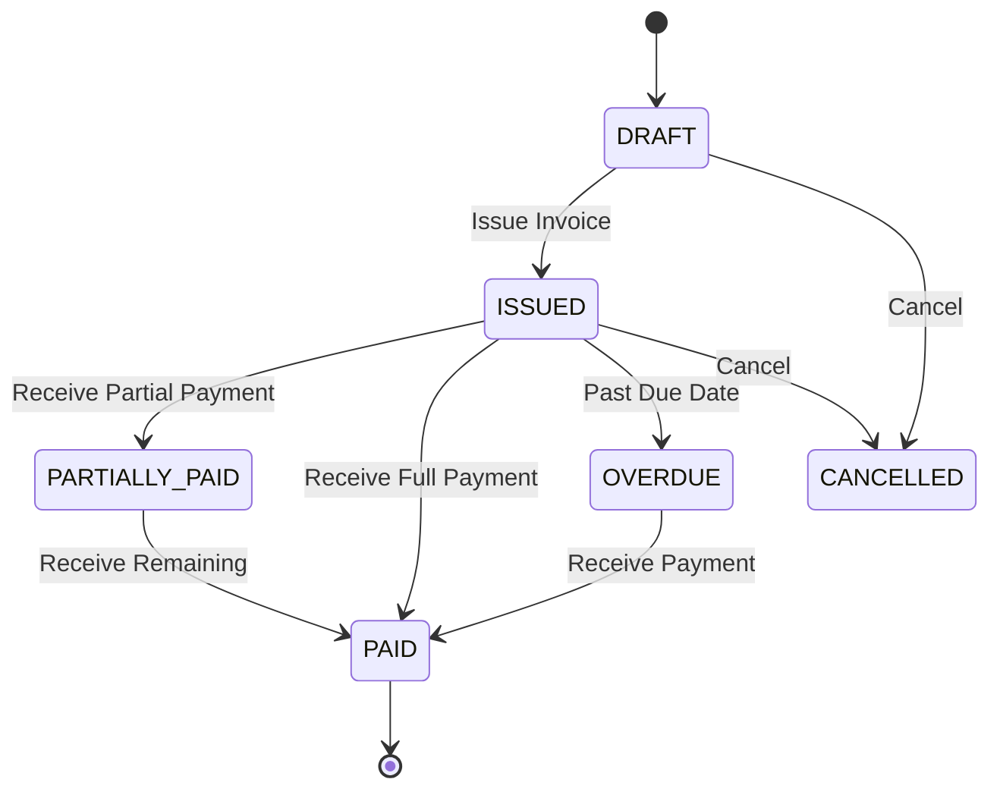
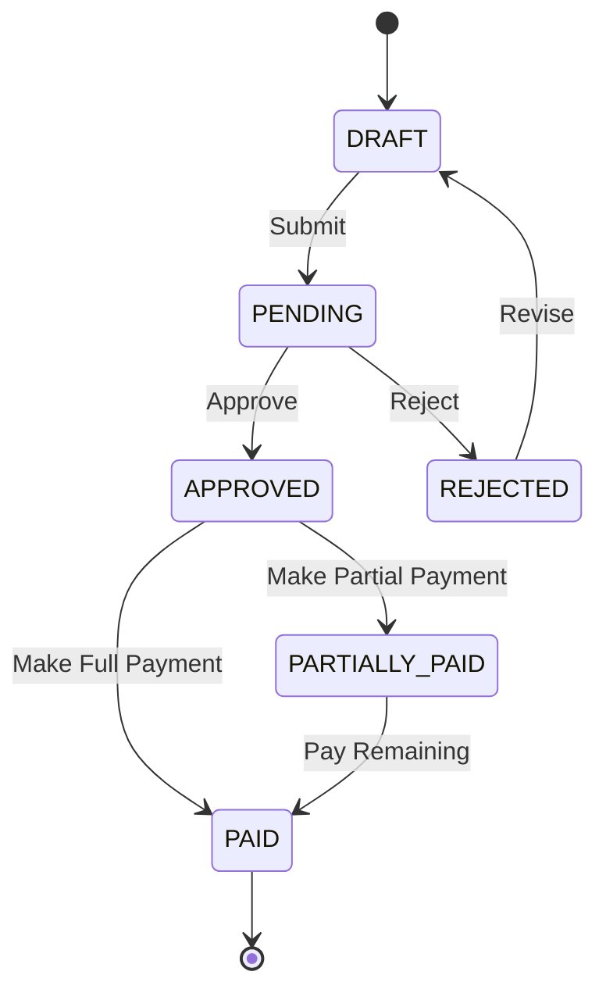
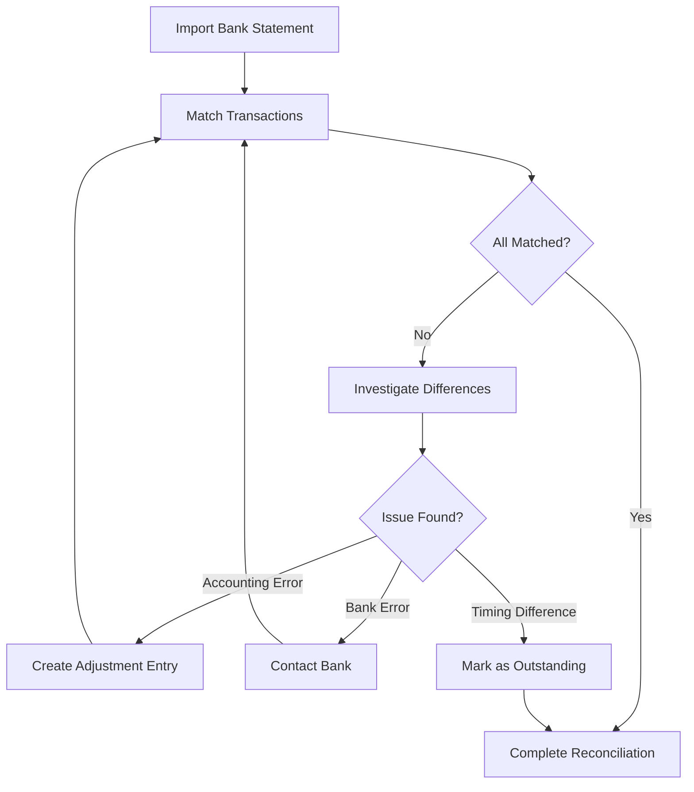

# Accounting Module User Manual

## Table of Contents

1. [Overview](#overview)
2. [Chart of Accounts](#chart-of-accounts)
3. [Journal Entries](#journal-entries)
4. [Customer Invoices](#customer-invoices)
5. [Vendor Bills](#vendor-bills)
6. [Payments](#payments)
7. [Bank Reconciliation](#bank-reconciliation)
8. [All Transactions](#all-transactions)
9. [Currency & Forex](#currency--forex)
10. [Cost Centres](#cost-centres)
11. [Financial Reports](#financial-reports)
12. [GST & TDS Compliance](#gst--tds-compliance)

---

## Overview

The Accounting Module provides comprehensive financial management capabilities including double-entry bookkeeping, invoicing, payments, tax compliance (GST/TDS for India), and financial reporting.

### Key Features

- Complete Chart of Accounts management
- Double-entry journal entries
- Customer invoicing and vendor bill management
- Multi-currency support
- Bank reconciliation
- Project-based cost tracking
- GST and TDS compliance reporting
- Financial statements (Balance Sheet, P&L, Cash Flow)

### Navigation

Access the Accounting Module from the main dashboard by clicking **Accounting** in the navigation menu.

[Screenshot: Main Dashboard with Accounting Module highlighted]

---

## Chart of Accounts

The Chart of Accounts (COA) is the foundation of your accounting system. It organizes all financial accounts into a hierarchical structure.

**Navigation:** Accounting → Chart of Accounts

### Account Types

| Type        | Code Range | Description                  |
| ----------- | ---------- | ---------------------------- |
| Assets      | 1000-1999  | What the company owns        |
| Liabilities | 2000-2999  | What the company owes        |
| Equity      | 3000-3999  | Owner's stake in the company |
| Revenue     | 4000-4999  | Income from operations       |
| Expenses    | 5000-5999  | Costs of operations          |

### Account Hierarchy

```
Assets (1000)
├── Current Assets (1100)
│   ├── Cash and Bank (1110)
│   │   ├── Cash in Hand (1111)
│   │   ├── Bank Account - SBI (1112)
│   │   └── Bank Account - HDFC (1113)
│   ├── Accounts Receivable (1120)
│   └── Inventory (1130)
└── Fixed Assets (1200)
    ├── Plant & Machinery (1210)
    └── Vehicles (1220)
```

[Screenshot: Chart of Accounts tree view]

### Creating an Account

1. Click **Add Account**
2. Fill in the account details:
   - **Account Code**: Unique numeric code
   - **Account Name**: Descriptive name
   - **Account Type**: Asset, Liability, Equity, Revenue, or Expense
   - **Parent Account**: Select parent for hierarchy (optional)
   - **Description**: Additional details
   - **Is Active**: Toggle account status

[Screenshot: New Account form]

### Editing an Account

1. Click the **Edit** icon on the account row
2. Modify allowed fields (code changes may be restricted if transactions exist)
3. Save changes

> **Warning:** Changing account types after transactions are posted can cause reporting issues.

### Account Balance

Each account displays:

- Current balance
- Debit total
- Credit total
- Last transaction date

---

## Journal Entries

Journal Entries record financial transactions using double-entry bookkeeping. Every debit must have an equal credit.

**Navigation:** Accounting → Journal Entries

### Journal Entry Types

| Type     | Description        | Example             |
| -------- | ------------------ | ------------------- |
| General  | Manual adjustments | Depreciation entry  |
| Sales    | Customer invoices  | Invoice posting     |
| Purchase | Vendor bills       | Bill posting        |
| Receipt  | Incoming payments  | Customer payment    |
| Payment  | Outgoing payments  | Vendor payment      |
| Transfer | Bank transfers     | Inter-bank transfer |

### Creating a Journal Entry

1. Click **New Journal Entry**
2. Enter header information:
   - **Entry Date**: Transaction date
   - **Reference**: External reference number
   - **Narration**: Description of the entry
   - **Entry Type**: Select from dropdown

[Screenshot: Journal Entry header]

3. Add line items:
   - Click **Add Line**
   - Select **Account**
   - Enter **Debit** OR **Credit** amount (not both)
   - Add **Description** for the line
   - Repeat for all lines

[Screenshot: Journal Entry lines]

4. Verify that **Total Debits = Total Credits**
5. Click **Save** or **Post**

### Journal Entry States

| Status   | Description                            |
| -------- | -------------------------------------- |
| Draft    | Entry saved but not posted             |
| Posted   | Entry finalized and affecting balances |
| Reversed | Entry has been reversed                |

### Posting a Journal Entry

1. Review all lines for accuracy
2. Verify debits equal credits
3. Click **Post**
4. Entry is now permanent

> **Note:** Posted entries cannot be edited. Create a reversal entry to correct mistakes.

### Reversing a Journal Entry

1. Open the posted entry
2. Click **Reverse**
3. Select reversal date
4. A new entry with opposite debits/credits is created

---

## Customer Invoices

Customer Invoices document amounts owed by customers for goods or services provided.

**Navigation:** Accounting → Customer Invoices

### Invoice Status Workflow



### Status Definitions

| Status         | Color  | Description              |
| -------------- | ------ | ------------------------ |
| DRAFT          | Gray   | Invoice being prepared   |
| ISSUED         | Blue   | Sent to customer         |
| PARTIALLY_PAID | Orange | Partial payment received |
| PAID           | Green  | Fully paid               |
| OVERDUE        | Red    | Past due date, unpaid    |
| CANCELLED      | Gray   | Invoice cancelled        |

### Creating a Customer Invoice

1. Click **New Invoice**
2. Enter invoice details:
   - **Customer**: Select from entity list
   - **Invoice Date**: Date of invoice
   - **Due Date**: Payment due date
   - **Project**: Associated project (for cost tracking)
   - **Currency**: INR, USD, AED, EUR

[Screenshot: Invoice header form]

3. Add line items:
   - **Description**: Item/service description
   - **HSN/SAC Code**: For GST compliance
   - **Quantity**: Number of units
   - **Unit Price**: Price per unit
   - **Tax Rate**: Applicable GST rate

[Screenshot: Invoice line items]

4. Review totals:
   - Subtotal
   - Tax breakdown (CGST, SGST, IGST)
   - Grand Total

5. Click **Save as Draft** or **Issue**

### GST Calculations

For Indian GST compliance:

**Intra-state supply (Same state):**

- CGST: 50% of GST rate
- SGST: 50% of GST rate

**Inter-state supply (Different states):**

- IGST: Full GST rate

Example for 18% GST:

- Intra-state: 9% CGST + 9% SGST
- Inter-state: 18% IGST

### Invoice PDF

1. Open the issued invoice
2. Click **Download PDF**
3. PDF includes:
   - Company letterhead
   - Invoice details
   - Line items with taxes
   - Bank details
   - Terms and conditions

[Screenshot: Invoice PDF preview]

---

## Vendor Bills

Vendor Bills record amounts owed to vendors for goods or services received.

**Navigation:** Accounting → Vendor Bills

### Bill Status Workflow



### Creating a Vendor Bill

1. Click **New Bill**
2. Enter bill details:
   - **Vendor**: Select vendor entity
   - **Bill Number**: Vendor's invoice number
   - **Bill Date**: Date on vendor invoice
   - **Due Date**: Payment due date
   - **Purchase Order**: Link to PO (for three-way match)

[Screenshot: Vendor Bill form]

3. Add line items matching vendor invoice
4. Enter tax details (GST input credit)
5. Save or submit for approval

### TDS Deduction

For applicable payments, TDS (Tax Deducted at Source) is calculated:

| Payment Type        | TDS Section | Rate |
| ------------------- | ----------- | ---- |
| Professional Fees   | 194J        | 10%  |
| Contractor Payments | 194C        | 1-2% |
| Rent                | 194I        | 10%  |
| Commission          | 194H        | 5%   |

When creating a bill:

1. Enable **TDS Applicable**
2. Select **TDS Section**
3. System calculates TDS amount
4. Net payable = Bill Amount - TDS

---

## Payments

The Payments module handles both incoming (receipts) and outgoing (payments) transactions.

**Navigation:** Accounting → Payments

### Payment Types

| Type             | Description                    |
| ---------------- | ------------------------------ |
| Customer Receipt | Payment received from customer |
| Vendor Payment   | Payment made to vendor         |
| Advance Receipt  | Advance from customer          |
| Advance Payment  | Advance to vendor              |

### Recording a Customer Receipt

1. Click **New Payment**
2. Select **Payment Type**: Customer Receipt
3. Enter details:
   - **Customer**: Select customer
   - **Amount**: Payment amount
   - **Payment Date**: Date received
   - **Payment Method**: Cash, Cheque, Bank Transfer, etc.
   - **Reference**: Cheque number or transaction ID
   - **Bank Account**: Receiving bank account

[Screenshot: Customer Receipt form]

4. Allocate to invoices:
   - Select unpaid/partially paid invoices
   - Enter amount to allocate to each
   - Total allocation should equal payment amount

5. Save payment

### Recording a Vendor Payment

1. Click **New Payment**
2. Select **Payment Type**: Vendor Payment
3. Enter details:
   - **Vendor**: Select vendor
   - **Amount**: Payment amount (net of TDS if applicable)
   - **Payment Date**: Date of payment
   - **Payment Method**: Select method
   - **Bank Account**: Paying bank account

4. Allocate to bills:
   - Select approved bills
   - Enter amount for each
   - Handle TDS if applicable

5. Save payment

### Partial Payments

Both invoices and bills support partial payments:

1. Allocate less than full amount
2. Remaining balance stays open
3. Status shows as PARTIALLY_PAID
4. Repeat for subsequent payments

---

## Bank Reconciliation

Bank Reconciliation matches your accounting records with bank statements to identify discrepancies.

**Navigation:** Accounting → Bank Reconciliation

### Reconciliation Process



### Starting a Reconciliation

1. Click **New Reconciliation**
2. Select **Bank Account**
3. Enter **Statement Date** (usually month-end)
4. Enter **Statement Ending Balance** (from bank statement)

[Screenshot: New Reconciliation form]

### Matching Transactions

The reconciliation screen shows:

- **Left side**: Unreconciled accounting entries
- **Right side**: Bank statement entries (if imported)

For each transaction:

1. Find matching entry
2. Click to match
3. Verified matches turn green

[Screenshot: Reconciliation matching screen]

### Outstanding Items

Items that don't match are outstanding:

- **Outstanding Checks**: Checks issued but not yet cleared
- **Deposits in Transit**: Deposits made but not yet reflected
- **Bank Charges**: Fees not yet recorded
- **Interest**: Interest earned not yet recorded

### Completing Reconciliation

1. Verify: Book Balance + Adjustments = Bank Balance
2. Record any missing entries (bank charges, interest)
3. Click **Complete Reconciliation**
4. Generate reconciliation report

---

## All Transactions

The All Transactions view provides a unified ledger of all financial activities.

**Navigation:** Accounting → All Transactions

### Available Filters

- **Date Range**: From date to To date
- **Transaction Type**: Journal, Invoice, Bill, Payment, etc.
- **Account**: Filter by specific account
- **Project**: Filter by project
- **Amount Range**: Min and max amounts
- **Search**: Free text search

[Screenshot: All Transactions with filters]

### Transaction Details

Each row shows:

- Date
- Transaction Number
- Type
- Description
- Debit Amount
- Credit Amount
- Running Balance (for account-specific views)

Click any transaction to view full details.

---

## Currency & Forex

Manage exchange rates and foreign currency transactions.

**Navigation:** Accounting → Currency & Forex

### Exchange Rate Management

1. Click **Add Exchange Rate**
2. Enter:
   - **From Currency**: e.g., USD
   - **To Currency**: e.g., INR
   - **Rate**: e.g., 83.50
   - **Effective Date**: When rate becomes active

[Screenshot: Exchange Rate form]

### Forex Gain/Loss

When settling foreign currency transactions:

- System calculates gain/loss based on rate difference
- Realized gain/loss posted to forex account
- Unrealized gain/loss shown for open items

Example:

- Invoice: USD 1,000 at rate 82.00 = INR 82,000
- Payment received at rate 83.50 = INR 83,500
- Forex Gain: INR 1,500

---

## Cost Centres

Cost Centres enable project-based financial tracking and reporting.

**Navigation:** Accounting → Cost Centres

### Setting Up Cost Centres

1. Click **New Cost Centre**
2. Enter:
   - **Name**: Cost centre name (usually project name)
   - **Code**: Unique identifier
   - **Project**: Link to project
   - **Budget**: Allocated budget amount

[Screenshot: Cost Centre form]

### Using Cost Centres

When creating transactions:

1. Select **Cost Centre** field
2. Choose appropriate cost centre
3. Transaction is tagged for reporting

### Cost Centre Reports

View project-wise financial summary:

- Total expenses
- Budget vs actual
- Category-wise breakdown
- Remaining budget

---

## Financial Reports

Generate standard financial statements and custom reports.

**Navigation:** Accounting → Reports

### Available Reports

#### Balance Sheet

Shows financial position at a point in time:

- Assets
- Liabilities
- Equity

**Parameters:**

- As of Date
- Comparison (previous period, previous year)

[Screenshot: Balance Sheet report]

#### Profit & Loss Statement

Shows financial performance over a period:

- Revenue
- Expenses
- Net Profit/Loss

**Parameters:**

- From Date
- To Date
- Comparison period

[Screenshot: P&L report]

#### Cash Flow Statement

Shows cash movements:

- Operating activities
- Investing activities
- Financing activities

#### Trial Balance

Lists all accounts with balances:

- Account Code
- Account Name
- Debit Balance
- Credit Balance

#### Account Ledger

Detailed transaction history for any account:

- Select account
- Select date range
- View all transactions with running balance

#### Project Financial Summary

Project-wise financial overview:

- Revenue by project
- Expenses by project
- Profit margin by project

### Exporting Reports

All reports can be exported:

- **PDF**: For printing/sharing
- **Excel**: For further analysis
- **CSV**: For data processing

---

## GST & TDS Compliance

Manage tax compliance requirements for Indian taxation.

**Navigation:** Accounting → GST & TDS

### GST Returns

#### GSTR-1 (Outward Supplies)

Details of outward supplies (sales):

1. Select **Period** (month)
2. System compiles all issued invoices
3. Review B2B and B2C breakdowns
4. Export for filing

[Screenshot: GSTR-1 report]

#### GSTR-2A/2B (Inward Supplies)

Auto-populated from vendor filings:

- Match with your recorded purchases
- Identify mismatches
- Reconcile input credit

#### GSTR-3B (Summary Return)

Monthly summary return:

- Outward tax liability
- Input tax credit
- Net tax payable
- Interest/late fees (if any)

### TDS Reports

#### TDS Deducted

Summary of TDS deducted from vendor payments:

- Section-wise breakdown
- Deductee details
- Certificate generation

#### Form 26Q Preparation

Quarterly TDS return data:

- All TDS transactions for quarter
- Deductee PAN validation
- Export for filing

### Tax Calendar

View upcoming compliance deadlines:

- GST return due dates
- TDS deposit dates
- TDS return filing dates

---

## Tips and Best Practices

1. **Reconcile regularly** - Monthly bank reconciliation catches errors early
2. **Use projects** - Tag all transactions to projects for accurate costing
3. **Review before posting** - Journal entries cannot be edited after posting
4. **Maintain GST compliance** - Record HSN/SAC codes for all items
5. **Back up data** - Regular exports protect against data loss
6. **Segregate duties** - Different users for creation and approval

---

## Troubleshooting

### Common Issues

**Q: Journal entry won't post - debits don't equal credits**
A: Check all line items. Even small rounding differences prevent posting.

**Q: Invoice shows wrong tax calculation**
A: Verify:

- Customer state vs your state (intra vs inter-state)
- Correct HSN/SAC code
- Tax rate for the item

**Q: Payment won't allocate to invoice**
A: Ensure:

- Customer matches on both
- Invoice is in ISSUED status
- Currency matches
- Sufficient unallocated amount

**Q: Bank reconciliation doesn't balance**
A: Check for:

- Outstanding checks
- Deposits in transit
- Bank charges not recorded
- Date cutoff issues

**Q: Cannot see certain accounts**
A: Verify the account is marked as Active.

---

_Last Updated: November 2024_
_Version: 1.0_
