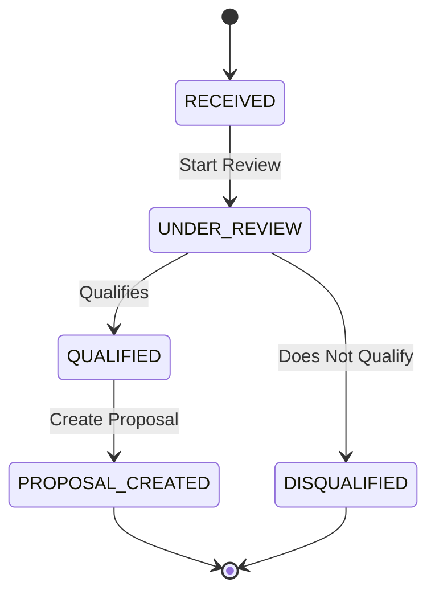
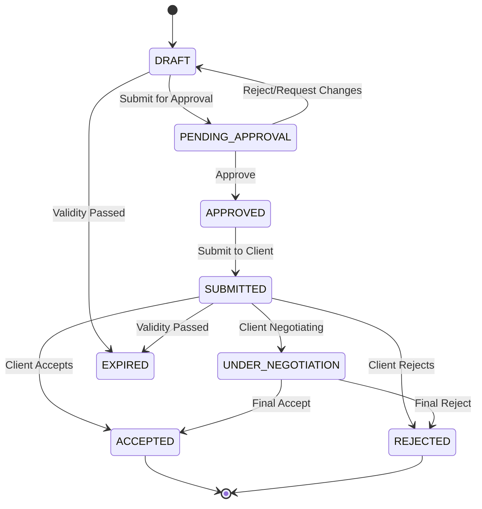
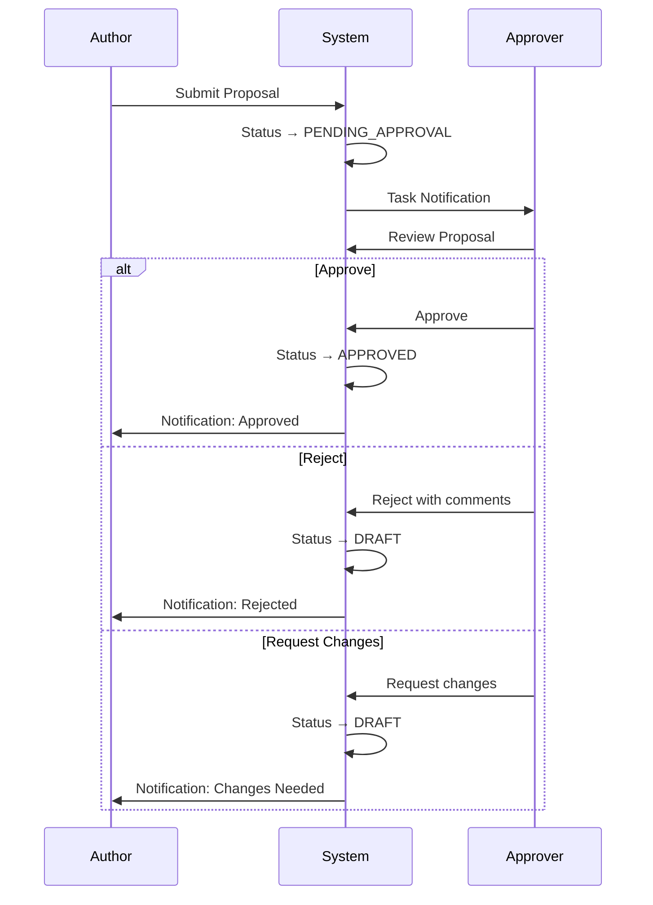
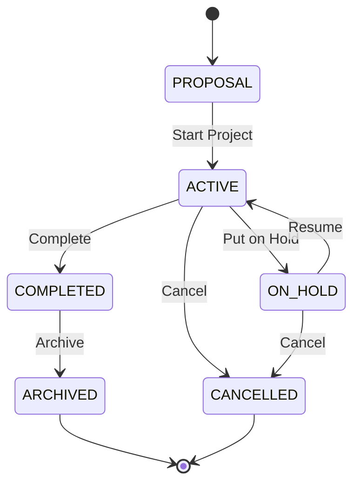
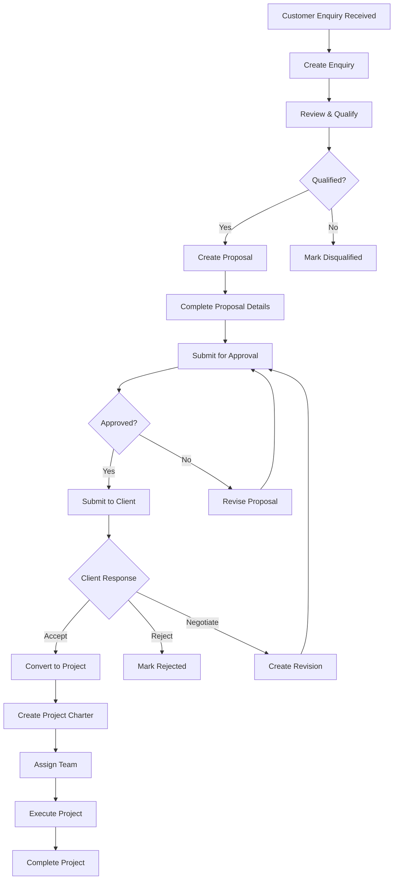

# Projects & Proposals Module User Manual

## Table of Contents

1. [Overview](#overview)
2. [Enquiries](#enquiries)
3. [Proposals](#proposals)
4. [Projects](#projects)
5. [Project Charter](#project-charter)
6. [End-to-End Workflow](#end-to-end-workflow)

---

## Overview

The Projects & Proposals Module manages the complete lifecycle from customer enquiry through proposal creation, approval, and project execution. It provides a seamless workflow for converting business opportunities into active projects.

### Key Features

- Customer enquiry tracking and management
- Proposal creation with detailed scope and pricing
- Multi-level approval workflow with task notifications
- Project creation from accepted proposals
- Project charter and team management
- Status tracking throughout the lifecycle

### Navigation

Access from the main dashboard:

- **Proposals** → Enquiries and Proposals
- **Projects** → Active projects and project management

[Screenshot: Dashboard with Proposals and Projects modules highlighted]

---

## Enquiries

Enquiries are the starting point for new business opportunities. They capture initial customer interest and requirements.

**Navigation:** Proposals → Enquiries

### Enquiry Sources

| Source   | Description                   |
| -------- | ----------------------------- |
| EMAIL    | Customer contacted via email  |
| PHONE    | Phone enquiry                 |
| MEETING  | Face-to-face meeting          |
| WEBSITE  | Web form submission           |
| REFERRAL | Referred by existing customer |
| OTHER    | Other sources                 |

### Enquiry Status Workflow

### Status Definitions

| Status           | Color  | Description          |
| ---------------- | ------ | -------------------- |
| RECEIVED         | Blue   | New enquiry received |
| UNDER_REVIEW     | Yellow | Being evaluated      |
| QUALIFIED        | Green  | Ready for proposal   |
| DISQUALIFIED     | Gray   | Not pursuing         |
| PROPOSAL_CREATED | Purple | Proposal generated   |

### Creating an Enquiry

**Navigation:** Proposals → Enquiries → New Enquiry

[Screenshot: New Enquiry button]

**Step 1: Basic Information**

1. Click **New Enquiry**
2. Fill in required fields:
   - **Title**: Brief description of the opportunity
   - **Client**: Select from customer entities
   - **Contact Person**: Client contact name
   - **Email**: Contact email
   - **Phone**: Contact phone number

[Screenshot: Enquiry form - Basic Information]

**Step 2: Enquiry Details**

1. Enter enquiry specifics:
   - **Received Date**: When enquiry was received
   - **Received Via**: Source channel (Email, Phone, etc.)
   - **Urgency**: LOW, MEDIUM, HIGH, or CRITICAL
   - **Project Type**: Type of work requested
     - SUPPLY_ONLY - Materials only
     - SUPPLY_AND_ERECTION - Materials + installation
     - ERECTION_ONLY - Installation only
     - TURNKEY - Complete solution
     - CONSULTATION - Advisory services
   - **Industry**: Customer's industry sector
   - **Location**: Project/delivery location

[Screenshot: Enquiry form - Details section]

**Step 3: Budget & Timeline**

1. Enter financial and timeline information:
   - **Estimated Budget**: Customer's budget indication
   - **Currency**: INR, USD, AED, EUR
   - **Required Delivery Date**: Customer's expected timeline

2. Add **Description/Scope Overview** with details

3. Click **Save** to create the enquiry

[Screenshot: Enquiry form - Budget section]

### Viewing Enquiry Details

From the enquiry list:

1. Click on the enquiry row or **View** icon
2. Detail page shows:
   - All enquiry information
   - Status and timeline
   - Associated proposal (if created)
   - Action buttons based on status

[Screenshot: Enquiry detail page]

### Editing an Enquiry

1. From enquiry detail, click **Edit**
2. Modify allowed fields
3. Save changes

> **Note:** Client cannot be changed after creation.

### Converting to Proposal

When an enquiry is qualified:

1. Click **Create Proposal** button
2. System pre-populates proposal with enquiry data
3. Complete the proposal wizard

---

## Proposals

Proposals are formal quotations sent to customers detailing scope, pricing, and terms.

**Navigation:** Proposals → Proposals

### Proposal Status Workflow

### Status Definitions

| Status            | Color  | Description                |
| ----------------- | ------ | -------------------------- |
| DRAFT             | Gray   | Proposal being prepared    |
| PENDING_APPROVAL  | Yellow | Awaiting internal approval |
| APPROVED          | Blue   | Approved, ready for client |
| SUBMITTED         | Blue   | Sent to client             |
| UNDER_NEGOTIATION | Orange | Client negotiating terms   |
| ACCEPTED          | Green  | Client accepted            |
| REJECTED          | Red    | Client rejected            |
| EXPIRED           | Gray   | Validity period passed     |

### Creating a Proposal

**Navigation:** Proposals → Proposals → New Proposal

The proposal wizard guides you through multiple steps:

[Screenshot: Proposal Wizard overview]

#### Step 1: Basic Information

1. Enter proposal basics:
   - **Title**: Proposal title/description
   - **Client**: Select customer (pre-filled if from enquiry)
   - **Enquiry**: Link to source enquiry (if any)
   - **Validity Date**: How long proposal is valid
   - **Revision Number**: Starts at 0, increments with revisions

[Screenshot: Proposal wizard - Step 1]

#### Step 2: Scope of Work

Define what you're offering:

1. **Scope Description**: Detailed scope narrative
2. **Deliverables**: List of items/services to be delivered
3. **Exclusions**: What's NOT included
4. **Assumptions**: Conditions/assumptions for the quote

[Screenshot: Proposal wizard - Step 2 Scope]

#### Step 3: Delivery & Timeline

1. **Delivery Period**: Duration for completion
2. **Milestones**: Key project milestones
3. **Dependencies**: Any client-side requirements

[Screenshot: Proposal wizard - Step 3 Delivery]

#### Step 4: Pricing

1. Add line items:
   - **Description**: Item/service description
   - **Quantity**: Number of units
   - **Unit**: Unit of measure
   - **Unit Price**: Price per unit
   - **Amount**: Calculated total

2. Review totals:
   - Subtotal
   - Taxes (if applicable)
   - Grand Total

3. Set **Payment Terms**:
   - Advance percentage
   - Progress payments
   - Final payment terms

[Screenshot: Proposal wizard - Step 4 Pricing]

#### Step 5: Terms & Conditions

1. Review standard terms
2. Add any special conditions
3. Include warranty/guarantee terms

#### Step 6: Review & Submit

1. Review entire proposal
2. **Save as Draft** to continue later
3. **Submit for Approval** when complete

### Proposal Approval Workflow

When a proposal is submitted for approval:

**For Approvers:**

1. You'll receive a task notification
2. Go to the proposal detail page
3. Review all sections:
   - Scope completeness
   - Pricing accuracy
   - Terms appropriateness
4. Take action:
   - **Approve**: Proposal ready for client
   - **Reject**: Provide rejection reason
   - **Request Changes**: Specify what needs changing

[Screenshot: Proposal approval actions]

### Submitting to Client

After approval:

1. Open the approved proposal
2. Click **Submit to Client**
3. Status changes to SUBMITTED
4. You can now:
   - Download PDF for sending
   - Track client response

[Screenshot: Submit to Client button]

### Managing Client Response

**When client accepts:**

1. Click **Mark as Accepted**
2. Status → ACCEPTED
3. **Create Project** button becomes available

**When client rejects:**

1. Click **Mark as Rejected**
2. Enter rejection reason for records
3. Status → REJECTED

**When negotiating:**

1. Click **Under Negotiation**
2. Create revised proposal if needed
3. Revision number increments

### Creating Proposal Revisions

When changes are needed:

1. Open the proposal
2. Click **Create Revision**
3. System creates new version with:
   - Same base information
   - Incremented revision number
   - Original proposal linked
4. Modify as needed
5. Submit through approval again

### Proposal PDF Generation

For approved proposals:

1. Click **Download PDF**
2. PDF includes:
   - Company letterhead
   - Full proposal content
   - Pricing breakdown
   - Terms and conditions
   - Signature blocks

[Screenshot: Proposal PDF preview]

---

## Projects

Projects are created from accepted proposals to track execution.

**Navigation:** Projects

### Project Status Workflow

### Status Definitions

| Status    | Color  | Description                          |
| --------- | ------ | ------------------------------------ |
| PROPOSAL  | Purple | Prospective (from accepted proposal) |
| ACTIVE    | Green  | Work in progress                     |
| ON_HOLD   | Yellow | Temporarily paused                   |
| COMPLETED | Blue   | Work finished                        |
| CANCELLED | Red    | Project cancelled                    |
| ARCHIVED  | Gray   | Closed and archived                  |

### Priority Levels

| Priority | Color  | Usage                             |
| -------- | ------ | --------------------------------- |
| CRITICAL | Red    | Urgent, needs immediate attention |
| HIGH     | Orange | Important, prioritize             |
| MEDIUM   | Yellow | Normal priority                   |
| LOW      | Gray   | Can be scheduled later            |

### Creating a Project

**From Accepted Proposal:**

1. Open the accepted proposal
2. Click **Convert to Project**
3. System creates project with:
   - Linked proposal
   - Client information
   - Scope from proposal
   - Auto-generated project code

[Screenshot: Convert to Project button]

**Manual Creation:**

**Navigation:** Projects → New Project

1. Click **New Project**
2. Fill in project details:
   - **Project Name**: Descriptive name
   - **Project Code**: Unique identifier (auto-generated or manual)
   - **Client**: Customer entity
   - **Project Manager**: Assign PM
   - **Priority**: Set priority level
   - **Description**: Project overview

[Screenshot: New Project form]

### Project List View

The project list displays:

| Column   | Description                  |
| -------- | ---------------------------- |
| Code     | Unique project code          |
| Name     | Project name                 |
| Client   | Customer name                |
| Status   | Current status (color-coded) |
| Priority | Priority level (color-coded) |
| PM       | Project manager              |
| Created  | Creation date                |

**Filtering Options:**

- Search by name, code, or client
- Filter by status
- Filter by priority
- Sort by any column

[Screenshot: Project list with filters]

### Statistics Dashboard

The project page shows summary statistics:

- **Total Projects**: All projects count
- **Active**: Currently in progress
- **Proposals**: Prospective projects
- **On Hold**: Paused projects
- **Completed**: Finished projects

[Screenshot: Project statistics cards]

### Project Detail Page

The project detail page contains:

**Header:**

- Project code and name
- Status badge
- Priority badge
- Action buttons

**Tabs/Sections:**

- **Overview**: Basic project information
- **Charter**: Project charter document
- **Team**: Team members assigned
- **Documents**: Project documents (links to Document module)
- **Procurement**: Related PRs, RFQs, POs
- **Financials**: Cost tracking (links to Accounting)

[Screenshot: Project detail page]

### Managing Project Status

**Starting a Project:**

1. Open project in PROPOSAL status
2. Click **Start Project**
3. Status → ACTIVE

**Putting on Hold:**

1. Click **Put on Hold**
2. Enter hold reason
3. Status → ON_HOLD

**Resuming:**

1. Click **Resume Project**
2. Status → ACTIVE

**Completing:**

1. Click **Mark Complete**
2. Confirm completion
3. Status → COMPLETED

**Archiving:**

1. Only completed projects can be archived
2. Click **Archive**
3. Status → ARCHIVED

### Editing a Project

1. Click **Edit** on project detail page
2. Modify allowed fields:
   - Name, description
   - Priority
   - Project manager
   - Team members
3. Save changes

> **Note:** Project code cannot be changed after creation.

---

## Project Charter

The Project Charter is a formal document that authorizes the project and provides key information.

**Navigation:** Projects → [Select Project] → Charter

### Charter Contents

The charter template includes:

1. **Project Overview**
   - Project name and code
   - Client information
   - Project description

2. **Objectives**
   - Business objectives
   - Project goals
   - Success criteria

3. **Scope**
   - In-scope items
   - Out-of-scope items
   - Key deliverables

4. **Stakeholders**
   - Project sponsor
   - Key stakeholders
   - Communication plan

5. **Timeline**
   - Start date
   - Key milestones
   - End date

6. **Budget**
   - Approved budget
   - Cost breakdown
   - Contingency

7. **Team**
   - Project manager
   - Team members
   - Roles and responsibilities

8. **Risks**
   - Identified risks
   - Mitigation plans

9. **Approvals**
   - Required signatures
   - Approval status

[Screenshot: Project Charter view]

### Creating/Editing Charter

1. Go to project charter tab
2. Click **Edit Charter**
3. Fill in each section
4. Save progress
5. Submit for approval when complete

### Charter Approval

1. Charter reviewed by stakeholders
2. Approvers sign off
3. Charter becomes official project document

---

## End-to-End Workflow

### Complete Business Flow

### Timeline Example

| Stage         | Duration  | Actions                       |
| ------------- | --------- | ----------------------------- |
| Enquiry       | Day 1-2   | Receive, review, qualify      |
| Proposal      | Day 3-7   | Create, review, approve       |
| Client Review | Day 8-14  | Submit, negotiate             |
| Project Setup | Day 15-17 | Create project, charter, team |
| Execution     | Day 18+   | Project work begins           |

### Quick Reference: Permissions

| Action            | Required Permission |
| ----------------- | ------------------- |
| Create Enquiry    | CREATE_ESTIMATES    |
| Create Proposal   | CREATE_ESTIMATES    |
| Approve Proposal  | APPROVE_ESTIMATES   |
| Create Project    | CREATE_PROJECTS     |
| Assign Team       | ASSIGN_PROJECTS     |
| View All Projects | VIEW_ALL_PROJECTS   |

---

## Tips and Best Practices

### Enquiries

1. **Capture everything** - Record all details during first contact
2. **Set accurate urgency** - Helps prioritize your pipeline
3. **Link to proposals** - Always create proposals from enquiries for traceability

### Proposals

1. **Be specific in scope** - Clear scope prevents disputes
2. **List exclusions** - What's NOT included is as important as what is
3. **Set realistic validity** - Give enough time but create urgency
4. **Get internal approval first** - Never send unapproved proposals

### Projects

1. **Complete the charter** - It's the project's foundation
2. **Assign the right team** - Skills should match requirements
3. **Link all documents** - Keep everything connected
4. **Update status promptly** - Accurate status helps everyone

---

## Troubleshooting

### Common Issues

**Q: Can't create proposal from enquiry**
A: Ensure enquiry status is QUALIFIED. Use the qualification action first.

**Q: Submit for Approval button is disabled**
A: Check that all required fields are filled. Review any validation messages.

**Q: Can't edit an approved proposal**
A: Approved proposals cannot be edited. Create a revision instead.

**Q: Convert to Project button not showing**
A: The proposal must be in ACCEPTED status.

**Q: Project code not auto-generating**
A: Check company settings for project code configuration.

**Q: Team members don't appear in selection**
A: Verify:

- User is active
- User belongs to your entity
- User has appropriate permissions

---

_Last Updated: November 2024_
_Version: 1.0_
