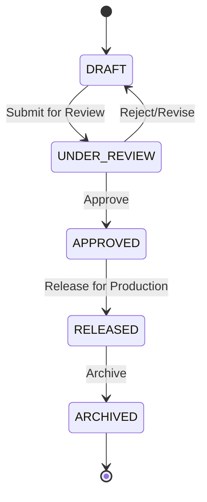

# Materials & Bill of Materials (BOM) User Manual

## Table of Contents

1. [Overview](#overview)
2. [Materials Module](#materials-module)
   - [Plates](#plates)
   - [Pipes](#pipes)
   - [Fittings](#fittings)
   - [Flanges](#flanges)
3. [Bought-Out Items](#bought-out-items)
4. [Estimation (BOM)](#estimation-bom)
5. [Material Usage in Procurement](#material-usage-in-procurement)

---

## Overview

The Materials & BOM modules provide a comprehensive engineering materials database and bill of materials management system. It supports material specifications, variants, and cost estimation for fabrication projects.

### Key Features

- Engineering materials database with technical specifications
- Category-based material organization (plates, pipes, fittings, flanges)
- Bought-out items catalog (pumps, valves, instruments)
- Bill of Materials (BOM) creation and management
- Cost estimation and tracking
- Integration with procurement for material ordering

### Navigation

Access from the main dashboard:

- **Materials** → Engineering materials database
- **Bought-Out** → Procured equipment catalog
- **Estimation** → Bill of Materials management

[Screenshot: Dashboard with Materials, Bought-Out, and Estimation modules]

---

## Materials Module

The Materials module maintains your engineering materials database with technical specifications.

**Navigation:** Materials

### Material Categories

| Category   | Description           | Standards     |
| ---------- | --------------------- | ------------- |
| Plates     | Sheet metal materials | ASTM, IS      |
| Pipes      | Tubular products      | ASTM, ASME    |
| Fittings   | Pipe connections      | ASME B16.9    |
| Flanges    | Pipe flanges          | ASME B16.5    |
| Fasteners  | Bolts, nuts, washers  | (Coming Soon) |
| Structural | Steel sections        | (Coming Soon) |

### Materials List View

[Screenshot: Materials list page]

**Dashboard Statistics:**

- Total materials count
- Active materials
- Materials by category
- Recently added

**Available Filters:**

- Search by name or specification
- Filter by category (tabs)
- Filter by material type
- Active/Inactive status

---

## Plates

Plate materials are flat metal products used in fabrication.

**Navigation:** Materials → Plates

### Plate Types

| Type            | Description                       |
| --------------- | --------------------------------- |
| Carbon Steel    | General structural applications   |
| Stainless Steel | Corrosion-resistant applications  |
| Duplex Steel    | High-strength corrosion-resistant |
| Alloy Steel     | Specialized applications          |

### Plate Specifications

Each plate entry includes:

- **Material Specification**: e.g., SA 516 Gr.70
- **Grade**: Material grade
- **Thickness Range**: Available thicknesses (mm)
- **Standard**: ASTM, IS, etc.
- **Supplier**: Associated vendor

[Screenshot: Plate detail with specifications]

### Creating a Plate Material

1. Click **New Plate**
2. Fill in specifications:
   - **Name**: Descriptive name
   - **Specification**: e.g., ASTM A516 Gr.70
   - **Type**: Carbon Steel, SS, etc.
   - **Grade**: Material grade
   - **Available Thicknesses**: List of standard thicknesses
   - **Price per kg**: Current pricing
   - **Supplier**: Select vendor

[Screenshot: New Plate form]

### Plate Thickness Variants

Plates come in standard thicknesses:

- 6mm, 8mm, 10mm, 12mm, 16mm, 20mm, 25mm, etc.

When creating a plate:

1. Add all available thicknesses
2. Each thickness can have its own pricing
3. Variants are used in BOM selection

---

## Pipes

Pipe materials for process and structural applications.

**Navigation:** Materials → Pipes

### Pipe Types

| Type                  | Description                |
| --------------------- | -------------------------- |
| Carbon Steel Seamless | High-pressure applications |
| Carbon Steel Welded   | General applications       |
| SS 304L Seamless      | Corrosion-resistant        |
| SS 316L Seamless      | High corrosion-resistant   |

### Pipe Specifications

Each pipe entry includes:

- **Material Specification**: e.g., ASTM A106 Gr.B
- **Type**: Seamless/Welded
- **Schedule**: Wall thickness designation
- **Size Range**: Nominal diameters available
- **Standard**: ASTM, ASME, etc.

[Screenshot: Pipe specifications]

### Schedule Reference

Standard ASTM schedules:

| Schedule | Description        |
| -------- | ------------------ |
| Sch 5    | Extra light wall   |
| Sch 10   | Light wall         |
| Sch 40   | Standard wall      |
| Sch 80   | Extra heavy wall   |
| Sch 160  | Double extra heavy |
| XXS      | Extra extra strong |

### Creating a Pipe Material

1. Click **New Pipe**
2. Enter specifications:
   - **Name**: Descriptive name
   - **Specification**: ASTM spec
   - **Type**: Seamless/Welded
   - **Material**: CS/SS304L/SS316L
   - **Available Sizes**: NPS sizes (1/2", 3/4", 1", etc.)
   - **Available Schedules**: Sch 10, 40, 80, etc.
   - **Price per meter**: By size/schedule

[Screenshot: New Pipe form]

---

## Fittings

Pipe fittings for connecting pipe sections.

**Navigation:** Materials → Fittings

### Fitting Types

| Type      | Standard   | Description                |
| --------- | ---------- | -------------------------- |
| Elbow 45° | ASME B16.9 | 45-degree direction change |
| Elbow 90° | ASME B16.9 | 90-degree direction change |
| Tee       | ASME B16.9 | Branch connection          |
| Reducer   | ASME B16.9 | Size transition            |
| Cap       | ASME B16.9 | End closure                |

### Fitting Specifications

Each fitting includes:

- **Type**: Elbow, Tee, Reducer, etc.
- **Material**: Same as pipe material
- **Size**: Matches pipe NPS
- **Schedule**: Must match connected pipe
- **Ends**: Butt weld, Socket weld, Threaded

[Screenshot: Fittings list]

### Reducer Designations

Reducers are designated by both sizes:

- **Concentric**: 4" x 3" (centered reduction)
- **Eccentric**: 4" x 3" ECC (offset reduction)

---

## Flanges

Pipe flanges for bolted connections.

**Navigation:** Materials → Flanges

### Flange Types

| Type        | Code | Description                     |
| ----------- | ---- | ------------------------------- |
| Weld Neck   | WN   | Welded to pipe, high integrity  |
| Slip-On     | SO   | Slides over pipe, fillet welded |
| Blind       | BL   | Closes pipe end                 |
| Socket Weld | SW   | Small bore connections          |
| Threaded    | THD  | Screwed connection              |

### Flange Specifications

Each flange includes:

- **Type**: WN, SO, BL, etc.
- **Material**: CS, SS, etc.
- **Size**: Pipe NPS
- **Pressure Rating**: 150#, 300#, 600#, etc.
- **Facing**: RF (Raised Face), FF (Flat Face), RTJ
- **Standard**: ASME B16.5

### Pressure Classes

ASME B16.5 pressure classes:

| Class | Typical Use                   |
| ----- | ----------------------------- |
| 150#  | Low pressure, general service |
| 300#  | Medium pressure               |
| 600#  | High pressure                 |
| 900#  | Very high pressure            |
| 1500# | Ultra high pressure           |
| 2500# | Extreme pressure              |

[Screenshot: Flange specifications]

---

## Bought-Out Items

Bought-out items are equipment and components purchased rather than fabricated.

**Navigation:** Bought-Out

### Categories

The bought-out module uses tabbed navigation:

| Tab         | Contents                                 |
| ----------- | ---------------------------------------- |
| All         | All bought-out items                     |
| Pumps       | Centrifugal, positive displacement, etc. |
| Valves      | Gate, Globe, Ball, Butterfly, etc.       |
| Instruments | Flow, Pressure, Temperature, etc.        |
| Electrical  | Motors, Panels, etc.                     |
| General     | Miscellaneous equipment                  |

[Screenshot: Bought-Out Items with category tabs]

### Pumps

**Pump Specifications:**

- **Type**: Centrifugal, Gear, Diaphragm, etc.
- **Flow Rate**: m³/hr capacity
- **Head**: Meters of head
- **MOC**: Material of construction
- **Motor**: Power rating
- **Make/Model**: Manufacturer info

[Screenshot: Pump detail]

### Valves

**Valve Specifications:**

- **Type**: Gate, Globe, Ball, Butterfly, etc.
- **Size**: NPS size
- **Pressure Rating**: Class 150, 300, etc.
- **MOC**: Body and trim materials
- **End Connection**: Flanged, Threaded, etc.
- **Actuation**: Manual, Pneumatic, Electric

[Screenshot: Valve detail]

### Instruments

**Instrument Specifications:**

- **Type**: Transmitter, Indicator, Switch, etc.
- **Measurement**: Flow, Pressure, Temperature, Level
- **Range**: Measurement range with units
- **Output**: 4-20mA, HART, etc.
- **Connection**: Process connection size

[Screenshot: Instrument detail]

### Creating a Bought-Out Item

1. Select the category tab
2. Click **New Item**
3. Fill in common fields:
   - **Item Code**: Unique identifier
   - **Name**: Descriptive name
   - **Category**: Auto-selected from tab
   - **Description**: Detailed description
   - **Supplier**: Preferred vendor
   - **Unit Price**: Current cost

4. Fill in category-specific fields
5. Save the item

[Screenshot: New Bought-Out Item form]

---

## Estimation (BOM)

The Estimation module manages Bills of Materials for fabrication projects.

**Navigation:** Estimation

### BOM Categories

| Category          | Description                     |
| ----------------- | ------------------------------- |
| Heat Exchanger    | Shell & tube, air coolers, etc. |
| Pressure Vessel   | Columns, reactors, drums        |
| Storage Tank      | Atmospheric tanks               |
| Piping Assembly   | Piping packages                 |
| Pump Package      | Pump skids                      |
| Structure         | Steel structures                |
| Electrical        | Electrical packages             |
| Instrumentation   | Instrument packages             |
| HVAC              | Heating/cooling systems         |
| General Equipment | Miscellaneous                   |
| Other             | Uncategorized                   |

### BOM Status Workflow



### Status Definitions

| Status       | Color  | Description                 |
| ------------ | ------ | --------------------------- |
| DRAFT        | Gray   | BOM being prepared          |
| UNDER_REVIEW | Yellow | Awaiting engineering review |
| APPROVED     | Green  | Technically approved        |
| RELEASED     | Blue   | Released for production     |
| ARCHIVED     | Gray   | Historical record           |

### Creating a BOM

**Navigation:** Estimation → New BOM

[Screenshot: New BOM button]

**Step 1: Basic Information**

1. Click **New BOM**
2. Enter BOM header:
   - **BOM Code**: Auto-generated or manual
   - **Name**: Descriptive name
   - **Category**: Select equipment type
   - **Project**: Link to project
   - **Description**: Equipment description

[Screenshot: BOM header form]

**Step 2: Add Line Items**

For each material/component:

1. Click **Add Item**
2. Select item source:
   - **Materials**: From materials database
   - **Bought-Out**: From bought-out catalog
   - **Manual**: One-off item

3. Fill in details:
   - **Item**: Select or enter
   - **Description**: Item description
   - **Quantity**: Required quantity
   - **Unit**: Unit of measure
   - **Unit Cost**: Cost per unit
   - **Remarks**: Additional notes

[Screenshot: BOM line item form]

**Step 3: Review and Save**

1. Review total item count
2. Review total estimated cost
3. Save as Draft or Submit for Review

### BOM Line Item Types

| Type       | Source               | Usage                 |
| ---------- | -------------------- | --------------------- |
| Plate      | Materials → Plates   | Shell, heads, nozzles |
| Pipe       | Materials → Pipes    | Process piping        |
| Fitting    | Materials → Fittings | Pipe connections      |
| Flange     | Materials → Flanges  | Bolted joints         |
| Bought-Out | Bought-Out Items     | Equipment             |
| Manual     | Direct entry         | One-off items         |

### BOM Cost Summary

The BOM displays cost breakdown:

```
┌─────────────────────────────────────────┐
│ BOM Cost Summary                        │
├─────────────────────────────────────────┤
│ Materials                     ₹ 150,000 │
│ Bought-Out Items              ₹ 250,000 │
│ Manual Items                  ₹  50,000 │
├─────────────────────────────────────────┤
│ Total Estimated Cost          ₹ 450,000 │
└─────────────────────────────────────────┘
```

[Screenshot: BOM cost summary]

### Editing a BOM

Only DRAFT status BOMs can be edited:

1. Open the BOM
2. Click **Edit**
3. Modify line items:
   - Add new items
   - Edit quantities/costs
   - Remove items
4. Save changes

### BOM Approval

1. Submit BOM for review
2. Reviewer checks:
   - Material specifications correct
   - Quantities reasonable
   - Costs accurate
3. Approve or return for revision

### Releasing a BOM

Approved BOMs can be released for production:

1. Open approved BOM
2. Click **Release**
3. BOM becomes read-only
4. Can be used to generate PRs

---

## Material Usage in Procurement

### Creating PRs from BOM

Once a BOM is released:

1. Open the BOM
2. Click **Create Purchase Request**
3. System creates PR with:
   - BOM line items
   - Quantities from BOM
   - Project linkage

4. Submit PR through normal workflow

### Material Tracking

The system tracks:

- Material usage across projects
- Procurement history
- Cost trends
- Supplier performance

---

## Tips and Best Practices

### Materials Database

1. **Keep specifications accurate** - Verify ASTM/ASME specs
2. **Update pricing regularly** - Material costs fluctuate
3. **Use standard sizes** - Avoid custom sizes when possible
4. **Document suppliers** - Track preferred vendors

### BOMs

1. **Be thorough** - Include all materials, even small items
2. **Use standard items** - Select from database when possible
3. **Include wastage** - Add cutting/fabrication allowances
4. **Review carefully** - BOMs drive procurement costs

### Bought-Out Items

1. **Standardize equipment** - Reduces spares inventory
2. **Document specs clearly** - Prevents procurement errors
3. **Track lead times** - Long-lead items need early ordering

---

## Troubleshooting

### Common Issues

**Q: Material not appearing in dropdown**
A: Check:

- Material is marked as Active
- Correct category selected
- Search filter cleared

**Q: BOM total cost seems wrong**
A: Verify:

- All quantities are entered
- Unit costs are current
- Units are correct (per piece vs per kg)

**Q: Cannot edit released BOM**
A: Released BOMs are locked. Create a revision:

1. Click **Create Revision**
2. New draft BOM created
3. Make changes
4. Go through approval again

**Q: Bought-out item not linking to PR**
A: Ensure:

- Item has valid specification
- Supplier is assigned
- Item is active

**Q: Price per unit not calculating total**
A: Check unit of measure matches:

- Materials: usually per kg
- Pipes: usually per meter
- Fittings: usually per piece
- Equipment: usually per unit

---

_Last Updated: November 2024_
_Version: 1.0_
