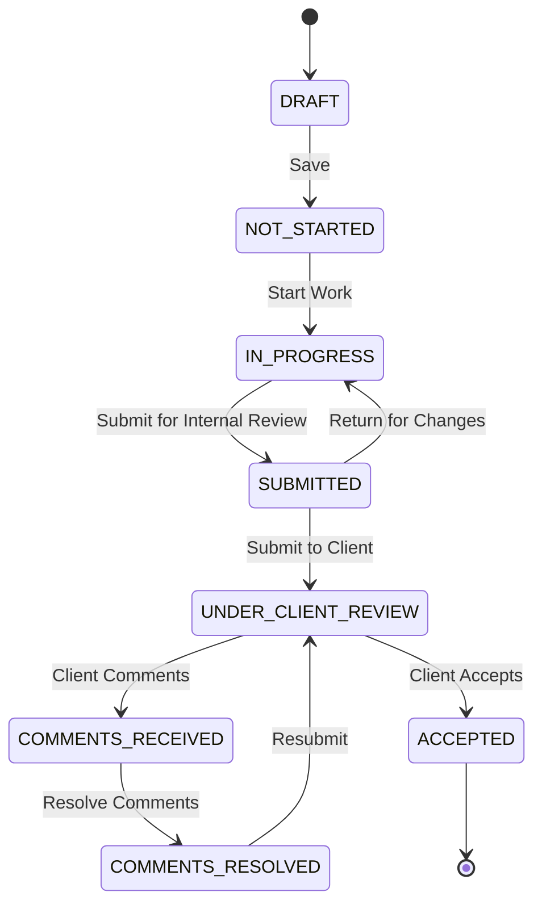

# Documents Module User Manual

## Table of Contents

1. [Overview](#overview)
2. [Master Document List](#master-document-list)
3. [Document Workflow](#document-workflow)
4. [Document Details](#document-details)
5. [Transmittals](#transmittals)
6. [Document Control](#document-control)

---

## Overview

The Documents Module provides comprehensive document management and control for engineering projects. It tracks document creation, review, client submissions, and approvals.

### Key Features

- Master document list management
- Document status tracking through review cycles
- Discipline-based organization
- Client visibility control
- Transmittal generation
- Document assignment and deadlines
- Comment tracking and resolution

### Navigation

Access the Documents Module from the main dashboard by clicking **Documents** in the navigation menu.

[Screenshot: Dashboard with Documents module highlighted]

---

## Master Document List

The Master Document List (MDL) is the central registry of all project documents.

**Navigation:** Documents

### Document List View

> **Important:** You must first select a project to view documents.

[Screenshot: Project selector dropdown]

**Steps to View Documents:**

1. Use the **Project** dropdown at the top
2. Select your project
3. Documents for that project are displayed

### List Columns

| Column       | Description                |
| ------------ | -------------------------- |
| Document No. | Unique document number     |
| Title        | Document title/description |
| Discipline   | Engineering discipline     |
| Status       | Current workflow status    |
| Visibility   | Client visible or internal |
| Assigned To  | Current assignee(s)        |
| Due Date     | Submission deadline        |
| Created      | Creation date              |

[Screenshot: Document list with columns]

### Dashboard Statistics

The document list header shows:

- **Total Documents**: Count of all documents
- **Overdue**: Past due date without completion
- **In Review**: Currently under review
- **Completed**: Accepted by client

### Filtering Documents

**Filter Options:**

| Filter     | Options                    |
| ---------- | -------------------------- |
| Status     | All statuses or specific   |
| Discipline | PI, ME, CE, E&I, etc.      |
| Visibility | Client Visible / Internal  |
| Search     | Number, title, description |

**Quick Filters (Buttons):**

- **My Documents**: Assigned to you
- **Overdue**: Past due date
- **Pending Review**: Awaiting your review
- **Client Visible**: External documents

[Screenshot: Document filters and quick filters]

---

## Document Workflow

Documents follow a defined workflow from creation to client acceptance.

### Document Status Workflow

### Status Definitions

| Status              | Color  | Description                   |
| ------------------- | ------ | ----------------------------- |
| DRAFT               | Gray   | Document entry created        |
| NOT_STARTED         | Gray   | Awaiting work to begin        |
| IN_PROGRESS         | Blue   | Work in progress              |
| SUBMITTED           | Yellow | Submitted for internal review |
| UNDER_CLIENT_REVIEW | Purple | Sent to client for review     |
| COMMENTS_RECEIVED   | Orange | Client provided comments      |
| COMMENTS_RESOLVED   | Blue   | Comments addressed            |
| ACCEPTED            | Green  | Client accepted final         |
| REJECTED            | Red    | Document rejected             |

### Status Transitions

| Current Status      | Available Actions        |
| ------------------- | ------------------------ |
| DRAFT               | Save, Delete             |
| NOT_STARTED         | Start Work               |
| IN_PROGRESS         | Submit for Review        |
| SUBMITTED           | Submit to Client, Return |
| UNDER_CLIENT_REVIEW | Record Comments, Accept  |
| COMMENTS_RECEIVED   | Mark Resolved            |
| COMMENTS_RESOLVED   | Resubmit to Client       |
| ACCEPTED            | (Final status)           |

---

## Document Details

### Creating a Document

**Navigation:** Documents → New Document

[Screenshot: New Document button]

**Step 1: Basic Information**

1. Click **New Document**
2. Enter required fields:
   - **Document Number**: Unique identifier (follow naming convention)
   - **Title**: Descriptive document title
   - **Project**: Associated project (required)
   - **Discipline**: Engineering discipline

[Screenshot: New Document form - Basic Info]

**Step 2: Classification**

1. Set document properties:
   - **Visibility**:
     - CLIENT_VISIBLE - Can be shared with client
     - INTERNAL_ONLY - Internal use only
   - **Due Date**: Target completion date

[Screenshot: New Document form - Classification]

**Step 3: Assignment**

1. Assign document to team member(s)
2. Multiple assignees allowed
3. Assignees receive task notifications

**Step 4: Save**

1. Review all fields
2. Click **Save**
3. Document created in DRAFT status

### Document Numbering Convention

Typical format: `[PROJECT]-[DISCIPLINE]-[TYPE]-[SEQUENCE]`

Example: `PROJ001-PI-PFD-001`

| Component | Meaning                                |
| --------- | -------------------------------------- |
| PROJ001   | Project code                           |
| PI        | Discipline (Process & Instrumentation) |
| PFD       | Document type (Process Flow Diagram)   |
| 001       | Sequence number                        |

### Engineering Disciplines

| Code | Discipline                             |
| ---- | -------------------------------------- |
| PI   | Process & Instrumentation              |
| ME   | Mechanical                             |
| CE   | Civil                                  |
| E&I  | Electrical & Instrumentation           |
| ST   | Structural                             |
| HVAC | Heating, Ventilation, Air Conditioning |
| FIRE | Fire & Safety                          |

### Viewing Document Details

Click on a document to view its detail page:

**Header:**

- Document number and title
- Status badge
- Action buttons

**Information Sections:**

- Basic details
- Assignment information
- Timeline (created, due, submitted dates)

**Tabs:**

- **Comments**: Review comments history
- **Submissions**: Submission history
- **Attachments**: Document files
- **History**: Status change log

[Screenshot: Document detail page]

### Editing a Document

Documents can be edited when in editable status:

1. Click **Edit** on document detail
2. Modify allowed fields
3. Save changes

> **Note:** Some fields lock after certain status transitions.

---

## Working with Documents

### Starting Work

When assigned a document:

1. You receive a task notification
2. Open the document
3. Click **Start Work**
4. Status changes to IN_PROGRESS

[Screenshot: Start Work button]

### Submitting for Internal Review

When work is complete:

1. Upload document files (attachments)
2. Click **Submit for Review**
3. Enter submission notes
4. Status changes to SUBMITTED
5. Project Manager receives review notification

[Screenshot: Submit for Review dialog]

### Internal Review (Project Manager)

When reviewing submitted documents:

1. Review attached files
2. Check quality and completeness
3. Take action:
   - **Submit to Client**: Ready for client
   - **Return for Changes**: Needs more work

[Screenshot: PM Review actions]

### Submitting to Client

1. Click **Submit to Client**
2. Select transmittal (or create new)
3. Confirm submission
4. Status changes to UNDER_CLIENT_REVIEW

### Recording Client Comments

When client provides feedback:

1. Click **Record Comments**
2. Enter comment details
3. Assign to team member for resolution
4. Status changes to COMMENTS_RECEIVED

[Screenshot: Record Comments dialog]

### Resolving Comments

1. Address all client comments
2. Update document as needed
3. Click **Mark Comments Resolved**
4. Status changes to COMMENTS_RESOLVED
5. Ready for resubmission

### Client Acceptance

When client approves:

1. Click **Mark Accepted**
2. Enter acceptance reference/date
3. Status changes to ACCEPTED
4. Document workflow complete

---

## Transmittals

Transmittals are formal document packages sent to clients.

**Navigation:** Documents → Transmittals

### What is a Transmittal?

A transmittal:

- Groups related documents together
- Provides a cover sheet
- Creates an official record of submission
- Tracks client acknowledgment

### Transmittal Status

| Status       | Description              |
| ------------ | ------------------------ |
| DRAFT        | Being prepared           |
| ISSUED       | Sent to client           |
| ACKNOWLEDGED | Client confirmed receipt |

### Creating a Transmittal

1. Click **New Transmittal**
2. Enter transmittal details:
   - **Transmittal Number**: Auto-generated or manual
   - **Project**: Select project
   - **To**: Client contact name
   - **Subject**: Brief description
   - **Purpose**: For Review, For Approval, For Construction, etc.

[Screenshot: New Transmittal form]

3. Add documents:
   - Click **Add Documents**
   - Select from available documents
   - Documents must be in appropriate status

4. Set response requirements:
   - Response required: Yes/No
   - Response due date

5. Issue transmittal

### Transmittal Cover Sheet

The transmittal generates a cover sheet including:

- Transmittal number
- Date
- To/From details
- Document list with:
  - Document number
  - Title
  - Revision
  - Copies
  - Status code (IFC, IFA, AFC, etc.)
- Purpose codes
- Response requirements

[Screenshot: Transmittal cover sheet preview]

### Document Purpose Codes

| Code     | Meaning                   |
| -------- | ------------------------- |
| IFA      | Issued for Approval       |
| IFC      | Issued for Construction   |
| IFR      | Issued for Review         |
| IFQ      | Issued for Quotation      |
| AFC      | Approved for Construction |
| AS-BUILT | As-built documentation    |

### Tracking Transmittals

The transmittal list shows:

- Transmittal number
- Date issued
- Document count
- Status
- Response status (if required)

---

## Document Control

### Document Visibility

**CLIENT_VISIBLE:**

- Can be included in transmittals
- Client can view in their portal (if enabled)
- Shows in client-visible filters

**INTERNAL_ONLY:**

- Not shared with client
- Internal working documents
- Hidden from client portal

### Access Permissions

| Permission                  | Description                       |
| --------------------------- | --------------------------------- |
| MANAGE_MASTER_DOCUMENT_LIST | Create/edit document entries      |
| ASSIGN_DOCUMENTS            | Assign documents to users         |
| SUBMIT_DOCUMENTS            | Submit to client                  |
| REVIEW_DOCUMENTS            | Client review access              |
| APPROVE_DOCUMENTS           | Approve submissions & resolutions |
| VIEW_CLIENT_DOCUMENTS       | View client-visible docs          |
| VIEW_INTERNAL_DOCUMENTS     | View internal docs                |

### Document Metrics

Track document progress:

**By Status:**

- Not started: X documents
- In progress: X documents
- Submitted: X documents
- Under client review: X documents
- Completed: X documents

**By Timeline:**

- On track: Due date not passed
- At risk: Due soon
- Overdue: Past due date

[Screenshot: Document metrics dashboard]

### Audit Trail

Every document maintains a history:

- Status changes with timestamps
- User who made changes
- Comments and notes
- File version history

---

## Task Notifications

The document module integrates with tasks:

### Notifications Generated

| Event                    | Notification Type | Recipient       |
| ------------------------ | ----------------- | --------------- |
| Document assigned        | Actionable        | Assignee        |
| Submitted for review     | Actionable        | PM/Reviewer     |
| Client comments received | Actionable        | Assignee        |
| Comments resolved        | Actionable        | PM for approval |
| Document accepted        | Informational     | Assignee        |

### Working with Tasks

1. View tasks in Tasks module
2. Click task to navigate to document
3. Complete required action
4. Task auto-completes on status change

---

## Tips and Best Practices

### Document Management

1. **Use consistent numbering** - Follow project naming conventions
2. **Set realistic due dates** - Account for review cycles
3. **Assign early** - Give team time to plan
4. **Update status promptly** - Keep workflow current

### Reviews

1. **Be thorough** - Review before submitting to client
2. **Document comments clearly** - Specific, actionable feedback
3. **Track resolutions** - Verify all comments addressed
4. **Close the loop** - Confirm client acceptance

### Transmittals

1. **Group logically** - Related documents together
2. **Use correct purpose codes** - IFA vs IFC matters
3. **Track responses** - Follow up on pending responses
4. **Maintain records** - Transmittals are contractual evidence

---

## Troubleshooting

### Common Issues

**Q: Cannot create documents - Project dropdown is empty**
A: Verify:

- You have access to projects
- Projects exist in the system
- You have VIEW permission for projects

**Q: Document not appearing in transmittal selection**
A: Check:

- Document is CLIENT_VISIBLE
- Document is in SUBMITTED or later status
- Document belongs to selected project

**Q: Cannot change document status**
A: Verify:

- You have required permission
- Current status allows that transition
- Required fields are complete

**Q: Assignee not receiving notifications**
A: Check:

- User is active
- User belongs to correct entity
- Notification settings enabled

**Q: Client comments not saving**
A: Ensure:

- Comment text is entered
- Document is in UNDER_CLIENT_REVIEW status
- You have REVIEW_DOCUMENTS permission

---

_Last Updated: November 2024_
_Version: 1.0_
