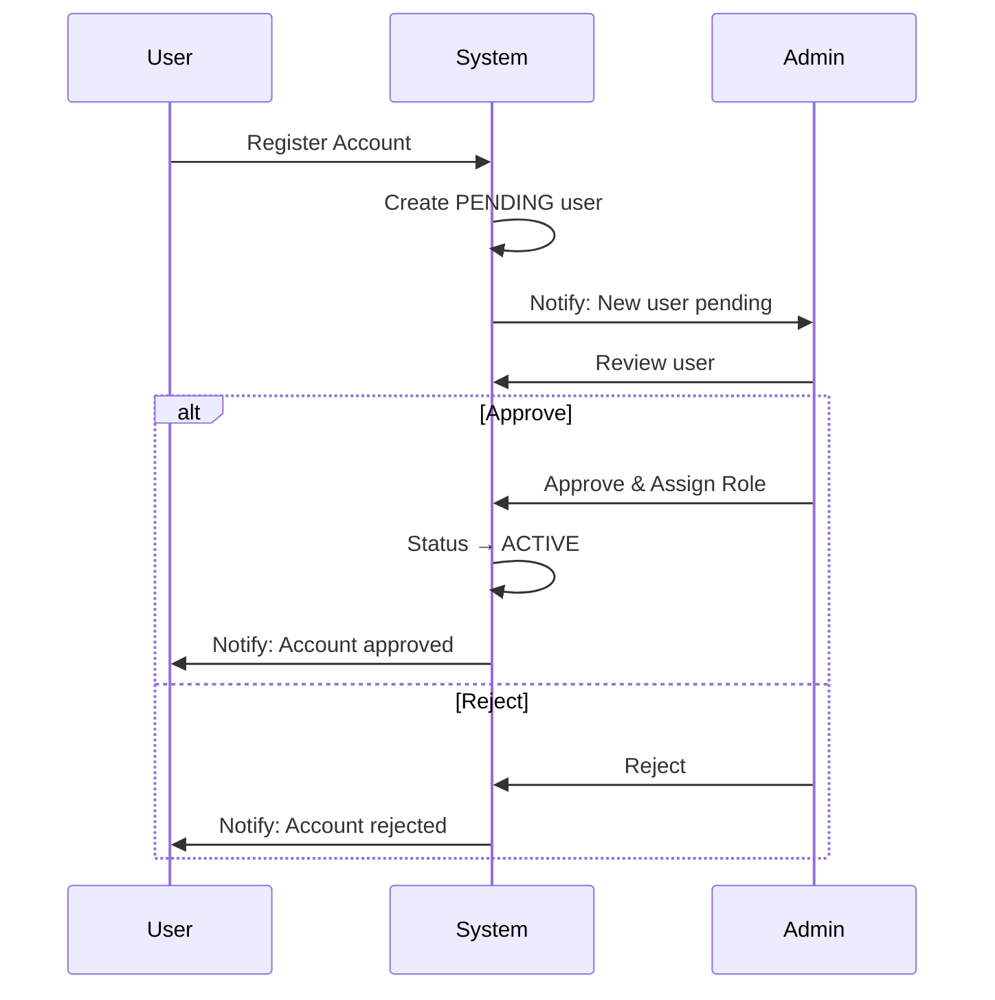

# Administration & Settings User Manual

## Table of Contents

1. [Overview](#overview)
2. [Company Settings](#company-settings)
3. [Entities Management](#entities-management)
4. [User Management](#user-management)
5. [Permissions & Roles](#permissions--roles)
6. [Tasks & Notifications](#tasks--notifications)
7. [System Administration](#system-administration)

---

## Overview

The Administration modules handle system configuration, user management, and organizational setup. These modules are typically accessible only to administrators.

### Key Features

- Company profile and settings
- Business entity management (vendors, customers)
- User account management
- Role-based permissions
- Task and notification system
- System configuration

### Navigation

Access administration features from:

- **Company** → Company settings
- **Entities** → Business entities
- **Users** → User management
- **Settings** → User preferences
- **Tasks** → Task notifications

[Screenshot: Dashboard with Administration modules]

---

## Company Settings

Company Settings contain your organization's profile and configuration.

**Navigation:** Company

### First-Time Setup

If company settings haven't been configured, you'll see a setup wizard:

[Screenshot: Company Setup Wizard]

**Step 1: Basic Information**

1. Enter company details:
   - **Company Name**: Legal business name
   - **Short Name**: Abbreviated name
   - **Industry**: Business sector
   - **Website**: Company website URL

**Step 2: Contact Information**

1. Enter address details:
   - **Address Line 1**: Street address
   - **Address Line 2**: Additional address info
   - **City**: City name
   - **State**: State/Province
   - **Country**: Country
   - **PIN/ZIP Code**: Postal code
   - **Phone**: Main phone number
   - **Email**: Company email

**Step 3: Tax Information**

1. Enter tax identifiers:
   - **GSTIN**: GST Identification Number (India)
   - **PAN**: Permanent Account Number (India)
   - **TAN**: Tax Deduction Account Number (India)

**Step 4: Banking Information**

1. Enter bank details:
   - **Bank Name**: Primary bank
   - **Account Number**: Bank account number
   - **IFSC Code**: Bank branch code
   - **Branch**: Branch name

**Step 5: Fiscal Settings**

1. Configure financial settings:
   - **Fiscal Year Start**: Month fiscal year begins
   - **Base Currency**: Primary currency (INR, USD, etc.)

2. Complete setup wizard

### Viewing Company Settings

After setup, the Company page shows:

**Company Profile:**

- Name and logo
- Contact information
- Tax IDs

**Financial Settings:**

- Fiscal year
- Base currency

**Bank Details:**

- Bank account information

[Screenshot: Company Settings view]

### Editing Company Settings

1. Click **Edit** button
2. Modify allowed fields
3. Save changes

> **Note:** Some fields (like GSTIN) may require verification after changes.

---

## Entities Management

Entities are business contacts including vendors, customers, and partners.

**Navigation:** Entities

### Entity Types

| Type     | Role     | Description               |
| -------- | -------- | ------------------------- |
| VENDOR   | Supplier | Companies you buy from    |
| CUSTOMER | Customer | Companies you sell to     |
| PARTNER  | Partner  | Business partners         |
| INTERNAL | Internal | Your own company/branches |

### Entity List View

[Screenshot: Entities list page]

**List Columns:**

- Entity Code
- Name
- Role (Vendor/Customer/etc.)
- Contact Person
- Email
- Status
- Actions

**Available Filters:**

- Search by name, code, email
- Filter by role type
- Filter by status

### Entity Status

| Status   | Color  | Description           |
| -------- | ------ | --------------------- |
| ACTIVE   | Green  | Normal operation      |
| INACTIVE | Gray   | Temporarily disabled  |
| PENDING  | Yellow | Awaiting verification |
| ARCHIVED | Gray   | Soft-deleted          |

### Creating an Entity

**Navigation:** Entities → New Entity

[Screenshot: New Entity form]

**Step 1: Basic Information**

1. Click **New Entity**
2. Enter required fields:
   - **Entity Code**: Unique identifier
   - **Name**: Legal entity name
   - **Role**: VENDOR, CUSTOMER, etc.

**Step 2: Contact Information**

1. Enter contact details:
   - **Contact Person**: Primary contact name
   - **Email**: Contact email
   - **Phone**: Contact phone
   - **Address**: Full address

**Step 3: Business Details**

1. Enter business information:
   - **GSTIN**: Tax ID (for India)
   - **PAN**: If applicable
   - **Payment Terms**: Net 30, Net 60, etc.
   - **Credit Limit**: If customer

**Step 4: Save**

1. Review all fields
2. Click **Save**
3. Entity created in ACTIVE status

### Entity Detail Page

The entity detail page shows:

**Header:**

- Entity name and code
- Status badge
- Role badge

**Information Sections:**

- Contact details
- Address
- Tax information
- Payment terms

**Related Information:**

- Purchase orders (if vendor)
- Invoices (if customer)
- Transaction history

[Screenshot: Entity detail page]

### Editing an Entity

1. Click **Edit** on entity detail
2. Modify fields as needed
3. Save changes

### Archiving an Entity

To archive (soft-delete) an entity:

1. Click **Archive** button
2. Confirm action
3. Entity marked as ARCHIVED
4. No longer appears in dropdowns

> **Note:** Archived entities preserve history but cannot be used in new transactions.

---

## User Management

User Management handles user accounts, roles, and permissions.

**Navigation:** Users

### User List View

[Screenshot: User list page]

**List Columns:**

- Name
- Email
- Role(s)
- Status
- Entity
- Created Date

**Filters:**

- Search by name/email
- Filter by status
- Filter by role

### User Status

| Status    | Color  | Description             |
| --------- | ------ | ----------------------- |
| PENDING   | Yellow | Awaiting admin approval |
| ACTIVE    | Green  | Can log in and work     |
| INACTIVE  | Gray   | Account disabled        |
| SUSPENDED | Red    | Account suspended       |

### User Registration Flow

### Approving New Users

When users register:

1. Go to Users list
2. Filter by PENDING status
3. Click on pending user
4. Review registration details
5. Take action:
   - **Approve**: Activate and assign role
   - **Reject**: Deny access

[Screenshot: User approval dialog]

### Creating a User (Admin)

Admins can create users directly:

1. Click **New User**
2. Enter user details:
   - **Email**: User email (login ID)
   - **Name**: Full name
   - **Entity**: Assign to entity
   - **Role**: Select role(s)
3. Click **Create**
4. User receives setup email

[Screenshot: New User form]

### Editing User Details

1. Click on user row
2. Click **Edit**
3. Modify allowed fields:
   - Name
   - Role(s)
   - Entity assignment
   - Status
4. Save changes

### Deactivating a User

1. Open user details
2. Click **Deactivate**
3. User status → INACTIVE
4. User cannot log in

### Reactivating a User

1. Open inactive user
2. Click **Activate**
3. User status → ACTIVE
4. User can log in again

---

## Permissions & Roles

The system uses bitwise permissions for efficient access control.

### Permission Categories

**User Management:**
| Permission | Description |
|------------|-------------|
| MANAGE_USERS | Create/edit users |
| ASSIGN_ROLES | Assign roles to users |

**Project Management:**
| Permission | Description |
|------------|-------------|
| CREATE_PROJECTS | Create new projects |
| VIEW_ALL_PROJECTS | View all projects |
| ASSIGN_PROJECTS | Assign team to projects |

**Time & Leave:**
| Permission | Description |
|------------|-------------|
| GENERATE_TIMESHEETS | Create timesheets |
| APPROVE_LEAVES | Approve leave requests |
| MANAGE_ON_DUTY | Manage on-duty records |

**Accounting:**
| Permission | Description |
|------------|-------------|
| CREATE_TRANSACTIONS | Create financial entries |
| APPROVE_TRANSACTIONS | Approve transactions |
| VIEW_REPORTS | View financial reports |

**Procurement:**
| Permission | Description |
|------------|-------------|
| CREATE_PR | Create purchase requests |
| APPROVE_PR | Approve purchase requests |
| CREATE_RFQ | Create RFQs |
| CREATE_PO | Create purchase orders |
| APPROVE_PO | Approve purchase orders |

**Estimation:**
| Permission | Description |
|------------|-------------|
| CREATE_ESTIMATES | Create estimates/proposals |
| APPROVE_ESTIMATES | Approve estimates |

**Documents:**
| Permission | Description |
|------------|-------------|
| MANAGE_MASTER_DOCUMENT_LIST | Manage MDL |
| ASSIGN_DOCUMENTS | Assign docs to users |
| SUBMIT_DOCUMENTS | Submit to client |
| REVIEW_DOCUMENTS | Client review access |
| APPROVE_DOCUMENTS | Approve submissions |
| VIEW_CLIENT_DOCUMENTS | View client docs |
| VIEW_INTERNAL_DOCUMENTS | View internal docs |

### Predefined Roles

| Role                | Description         | Key Permissions                  |
| ------------------- | ------------------- | -------------------------------- |
| SUPER_ADMIN         | Full system access  | All permissions                  |
| DIRECTOR            | Executive oversight | Approvals, reports, all views    |
| PROJECT_MANAGER     | Project leadership  | Projects, documents, estimates   |
| PROCUREMENT_MANAGER | Procurement lead    | All procurement permissions      |
| ACCOUNTANT          | Financial entry     | Transactions, reports            |
| FINANCE_MANAGER     | Financial approval  | Transactions, approvals, reports |
| ENGINEERING_HEAD    | Engineering lead    | Projects, timesheets, approvals  |
| ENGINEER            | Technical work      | Estimates, documents             |
| SITE_ENGINEER       | Site operations     | PRs, documents                   |
| HR_ADMIN            | HR management       | Users, roles, leaves             |
| TEAM_MEMBER         | Basic access        | Minimal permissions              |
| CLIENT_PM           | Client access       | View-only external access        |

### Viewing User Permissions

1. Open user details
2. View assigned role(s)
3. See effective permissions list

[Screenshot: User permissions display]

### Assigning Roles

1. Edit user
2. Select role from dropdown
3. Multiple roles can be assigned
4. Permissions combine (union of all role permissions)

---

## Tasks & Notifications

The Tasks module provides actionable and informational notifications.

**Navigation:** Tasks

### Task Types

| Type          | Description            | Action Required     |
| ------------- | ---------------------- | ------------------- |
| Actionable    | Requires work/response | Yes - complete task |
| Informational | FYI notification       | Acknowledge only    |

### Task Categories

**Procurement:**

- PR_SUBMITTED - Review PR
- PR_APPROVED/REJECTED - PR outcome
- PO_PENDING_APPROVAL - Approve PO
- PAYMENT_REQUESTED - Process payment

**Proposals:**

- PROPOSAL_SUBMITTED - Review proposal
- PROPOSAL_APPROVED/REJECTED - Outcome

**Documents:**

- DOCUMENT_ASSIGNED - Work on document
- DOCUMENT_CLIENT_COMMENTED - Resolve comments

**General:**

- TASK_ASSIGNED - Complete assigned task
- TASK_DEADLINE_APPROACHING - Deadline reminder

### Tasks Dashboard

[Screenshot: Tasks dashboard]

**Statistics:**

- Total tasks
- Pending
- In Progress
- Completed

**Time Tracking:**

- Time logged today
- Time this week
- Time this month

### Working with Tasks

**Viewing Tasks:**

1. Tasks list shows all your tasks
2. Filter by status, priority, type
3. Sort by date, priority

**Starting a Task:**

1. Click **Start** on actionable task
2. Timer begins (optional time tracking)
3. Status → In Progress

**Completing a Task:**

1. Complete the required action
2. Many tasks auto-complete on action
3. Or click **Complete** manually

**Acknowledging Informational Tasks:**

1. Click **Acknowledge**
2. Task marked as read

### Task Notifications

Users receive notifications for:

- New task assignments
- Approaching deadlines
- Status changes
- Completions

Notifications appear:

- In-app notification bell
- Tasks module counter
- (Email notifications if configured)

---

## System Administration

### Admin Dashboard

Super admins have access to additional tools:

**Navigation:** Admin

**Available Tools:**

- Seed data utilities
- Module integrations
- System configuration
- Audit logs

[Screenshot: Admin dashboard]

### Data Management

**Seed Materials:**

- Initialize materials database
- Load standard specifications

**Data Export:**

- Export data for backup
- Generate reports

### Module Integrations

Configure how modules interact:

- Accounting integrations
- Document linking rules
- Notification settings

---

## User Profile & Settings

### Personal Profile

**Navigation:** Dashboard → Profile

Users can update their own profile:

- Display name
- Contact information
- Avatar/photo
- Notification preferences

[Screenshot: User profile page]

### Settings

**Navigation:** Dashboard → Settings

Personal settings include:

- Date format preference
- Number format
- Default filters
- Dashboard widgets

---

## Tips and Best Practices

### Company Setup

1. **Complete all fields** - Thorough setup prevents issues later
2. **Verify tax IDs** - Ensure accuracy for compliance
3. **Set fiscal year correctly** - Affects financial reporting

### Entity Management

1. **Standardize codes** - Use consistent naming conventions
2. **Keep contacts current** - Update when people change
3. **Archive, don't delete** - Preserves audit trail

### User Management

1. **Use roles effectively** - Assign minimal required permissions
2. **Review pending users promptly** - Don't leave people waiting
3. **Deactivate departing users** - Maintain security
4. **Audit permissions regularly** - Review role assignments

### Tasks

1. **Check tasks daily** - Stay on top of notifications
2. **Complete promptly** - Workflows depend on timely responses
3. **Use time tracking** - Accurate project costing

---

## Troubleshooting

### Common Issues

**Q: Cannot create users**
A: Verify you have MANAGE_USERS permission.

**Q: User can't log in after approval**
A: Check:

- User status is ACTIVE
- Password was set/reset
- No account locks

**Q: Entity not appearing in dropdowns**
A: Verify:

- Entity status is ACTIVE
- Entity role matches context (VENDOR for purchasing)
- Not archived

**Q: Permissions not working correctly**
A: Check:

- User has correct role(s) assigned
- Role includes required permission
- Entity assignment is correct
- User has logged out and back in

**Q: Tasks not appearing**
A: Verify:

- Task filters are cleared
- You're the assignee
- Task is not completed/acknowledged

**Q: Cannot change company settings**
A: Ensure:

- You have MANAGE_ENTITIES permission
- Company record exists
- No validation errors

---

_Last Updated: November 2024_
_Version: 1.0_
